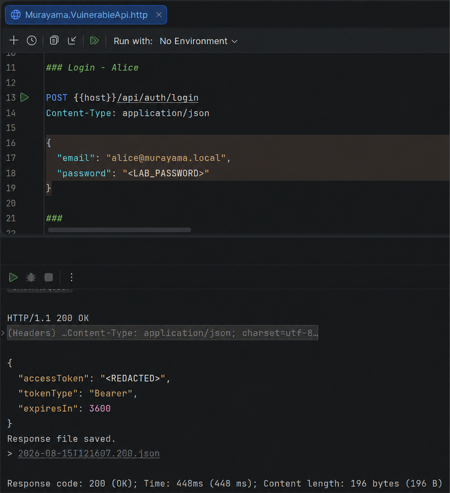
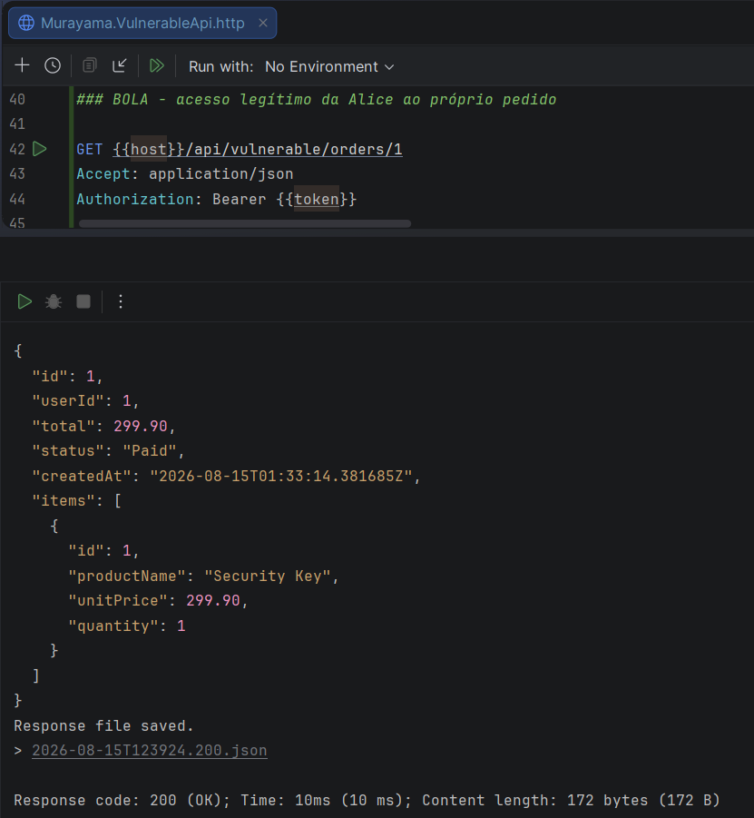
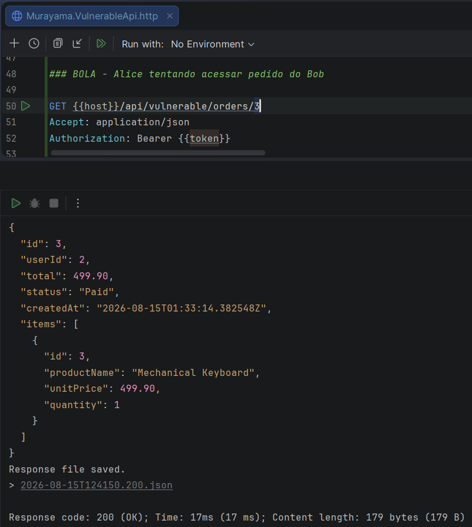
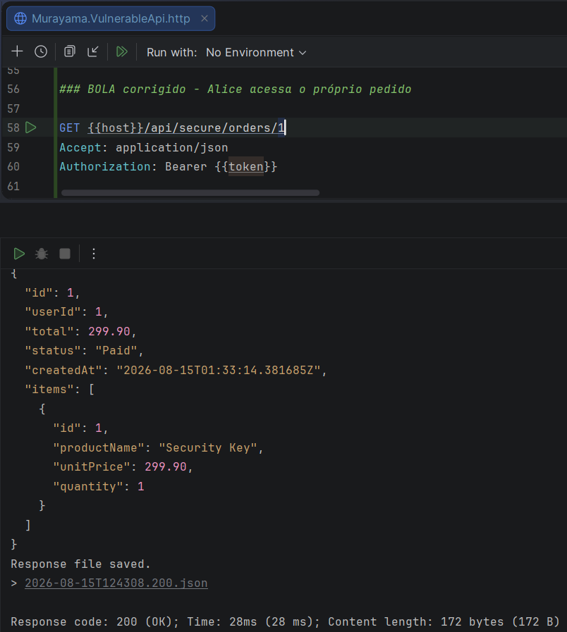
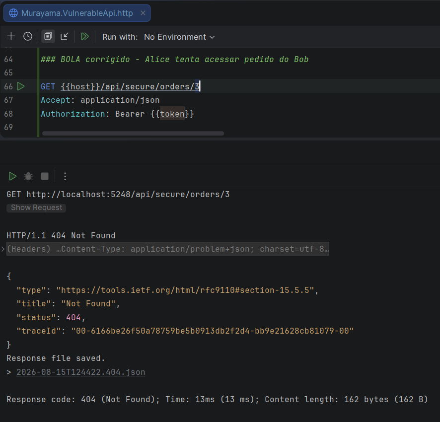

# API1:2023 — Broken Object Level Authorization (BOLA)

## Overview

This lab demonstrates a **Broken Object Level Authorization (BOLA)** vulnerability in the **Murayama Vulnerable API**, an intentionally vulnerable ASP.NET Core Web API created for cybersecurity and Application Security (AppSec) education.

The application correctly authenticates users using **JSON Web Tokens (JWT)**. However, the vulnerable endpoint fails to verify whether the authenticated user is authorized to access the requested object.

As a result, an authenticated user can access another user's order simply by changing the order identifier in the request.

---

## Classification

| Item | Classification |
|---|---|
| OWASP API Security Top 10 | API1:2023 — Broken Object Level Authorization |
| CWE | CWE-639 — Authorization Bypass Through User-Controlled Key |
| Security Category | Authorization / Access Control |
| Authentication Required | Yes |
| Exploitation Complexity | Low |

---

## Lab Scenario

The application contains three users:

| ID | Name | Email | Role |
|---:|---|---|---|
| 1 | Alice | alice@murayama.local | User |
| 2 | Bob | bob@murayama.local | User |
| 3 | Admin | admin@murayama.local | Admin |

The database also contains the following orders:

| Order ID | Owner | User ID | Total | Status |
|---:|---|---:|---:|---|
| 1 | Alice | 1 | 299.90 | Paid |
| 2 | Alice | 1 | 89.90 | Pending |
| 3 | Bob | 2 | 499.90 | Paid |

For this demonstration, **Alice authenticates normally** and receives a valid JWT.

Her authenticated identity corresponds to:

```text
UserId = 1
Role   = User
```

Alice should therefore be able to access orders `1` and `2`, but she must not be able to access order `3`, because it belongs to Bob.

---

# Vulnerable Implementation

## Endpoint

The intentionally vulnerable endpoint is:

```http
GET /api/vulnerable/orders/{id}
Authorization: Bearer <JWT>
```

The controller requires authentication:

```csharp
[Authorize]
```

Therefore, anonymous users cannot access the endpoint.

However, authentication alone is not sufficient.

The vulnerable implementation retrieves an order using only the identifier supplied in the URL:

```csharp
var order = await _dbContext.Orders
    .Include(o => o.Items)
    .FirstOrDefaultAsync(o => o.Id == id);
```

The security problem is specifically this condition:

```csharp
o.Id == id
```

The application verifies that the order exists, but it does **not verify that the order belongs to the authenticated user**.

Conceptually, the query behaves like:

```sql
SELECT *
FROM "Orders"
WHERE "Id" = @id;
```

There is no ownership condition.

---

# Exploitation

> This demonstration is performed only against the intentionally vulnerable local lab environment.

## Step 1 — Authenticate as Alice

Alice authenticates using the application's login endpoint:

```http
POST /api/auth/login
Content-Type: application/json

{
  "email": "alice@murayama.local",
  "password": "<LAB_PASSWORD>"
}
```

The API returns a valid JWT:

```json
{
  "accessToken": "<ALICE_JWT>",
  "tokenType": "Bearer",
  "expiresIn": 3600
}
```

The actual JWT is intentionally omitted from this documentation.

### Evidence



*Figure 1 — Alice successfully authenticates and receives a valid JWT.*

---

## Step 2 — Access Alice's Own Order

Alice requests order `1`:

```http
GET /api/vulnerable/orders/1
Authorization: Bearer <ALICE_JWT>
```

Order `1` belongs to Alice.

Expected response:

```http
HTTP/1.1 200 OK
```

Example:

```json
{
  "id": 1,
  "userId": 1,
  "total": 299.90,
  "status": "Paid"
}
```

This is legitimate access.

### Evidence



*Figure 2 — Alice legitimately accesses Order 1, which belongs to UserId 1.*

---

## Step 3 — Change Only the Object Identifier

Alice now changes the order identifier from:

```text
1
```

to:

```text
3
```

The request becomes:

```http
GET /api/vulnerable/orders/3
Authorization: Bearer <ALICE_JWT>
```

No authentication bypass is performed.

No token manipulation is required.

Alice continues using her own valid JWT.

However, order `3` belongs to:

```text
Bob — UserId 2
```
---

## Step 4 — Unauthorized Object Access

The vulnerable endpoint returns:

```http
HTTP/1.1 200 OK
```

and exposes Bob's order.

Example:

```json
{
  "id": 3,
  "userId": 2,
  "total": 499.90,
  "status": "Paid"
}
```

Alice (`UserId = 1`) has therefore accessed an object belonging to Bob (`UserId = 2`).

This demonstrates **Broken Object Level Authorization**.

### Evidence



*Figure 3 — BOLA exploitation: Alice is authenticated as UserId 1 but successfully retrieves Order 3 belonging to UserId 2.*

---

# Why Authentication Did Not Prevent the Vulnerability

The endpoint contains:

```csharp
[Authorize]
```

and Alice possesses a valid JWT.

The JWT authentication mechanism is functioning correctly.

The problem is the distinction between **authentication** and **authorization**.

Authentication answers:

> Who is making this request?

In this scenario:

```text
Alice
UserId = 1
```

Object-level authorization must additionally answer:

> Is Alice allowed to access this specific order?

The vulnerable endpoint never performs that second check.

The request flow is therefore:

```text
Alice
  │
  │ Valid credentials
  ▼
POST /api/auth/login
  │
  ▼
Valid JWT
  │
  ▼
GET /api/vulnerable/orders/3
  │
  ▼
[Authorize]
  │
  ├── Is the JWT valid? YES
  │
  ▼
Query Order.Id == 3
  │
  ├── Does Order 3 exist? YES
  │
  ▼
Return Bob's order
  │
  ▼
200 OK
```

The application authenticated Alice but failed to authorize access to the requested object.

---

# Root Cause

The root cause is a missing **object ownership authorization check**.

The vulnerable query is:

```csharp
.FirstOrDefaultAsync(o => o.Id == id);
```

The order ID is controlled by the client through the URL:

```text
/api/vulnerable/orders/{id}
```

Because ownership is not checked, an authenticated user can modify `{id}` and request objects belonging to other users.

---

# Secure Implementation

A corrected version is available through:

```http
GET /api/secure/orders/{id}
Authorization: Bearer <JWT>
```

The application obtains the authenticated user's identity from the validated JWT:

```csharp
var userIdClaim =
    User.FindFirstValue(ClaimTypes.NameIdentifier)
    ?? User.FindFirstValue("sub");

if (!int.TryParse(userIdClaim, out var userId))
    return Unauthorized();
```

The database query then includes the authenticated user's ID:

```csharp
var order = await _dbContext.Orders
    .Include(o => o.Items)
    .FirstOrDefaultAsync(o =>
        o.Id == id &&
        o.UserId == userId);
```

The requested object must now satisfy **both conditions**:

```text
Order.Id == requested order ID

AND

Order.UserId == authenticated user ID
```

Conceptually:

```sql
SELECT *
FROM "Orders"
WHERE "Id" = @id
  AND "UserId" = @authenticatedUserId;
```

The client controls the requested order ID, but it does **not control the authenticated user ID used for the authorization decision**.

That identity originates from the validated JWT.

---

# Verification of the Fix

## Alice Accessing Her Own Order

Request:

```http
GET /api/secure/orders/1
Authorization: Bearer <ALICE_JWT>
```

The conditions are:

```text
Order.Id     = 1
Order.UserId = 1
Alice.UserId = 1
```

Result:

```http
HTTP/1.1 200 OK
```

The request is authorized.

### Evidence



*Figure 4 — The secure endpoint preserves legitimate access to Alice's own Order 1.*

---

## Alice Attempting to Access Bob's Order

Request:

```http
GET /api/secure/orders/3
Authorization: Bearer <ALICE_JWT>
```

The requested order exists:

```text
Order.Id = 3
```

but:

```text
Order.UserId = 2
Alice.UserId = 1
```

Therefore the secure query finds no authorized object.

Result:

```http
HTTP/1.1 404 Not Found
```

The unauthorized resource is no longer exposed.

### Evidence



*Figure 5 — The secure endpoint returns 404 when Alice attempts to access Order 3 belonging to Bob.*

---

# Why Return 404 Instead of 403?

Another possible implementation would first retrieve the order and then verify ownership:

```text
Does Order 3 exist?
        │
       YES
        │
Does it belong to Alice?
        │
       NO
        │
       403
```

However, this behavior can reveal that a resource with ID `3` exists.

The secure implementation instead asks:

```text
Does Order 3 belonging to Alice exist?
```

For Alice, both of the following situations produce the same result:

```text
Order does not exist
```

and:

```text
Order exists but belongs to another user
```

The response is:

```http
404 Not Found
```

This reduces information disclosure that could assist object enumeration.

---

# Vulnerable vs Secure Code

## ❌ Vulnerable

```csharp
var order = await _dbContext.Orders
    .Include(o => o.Items)
    .FirstOrDefaultAsync(o => o.Id == id);
```

Authorization condition:

```text
Order.Id == requested ID
```

---

## ✅ Secure

```csharp
var order = await _dbContext.Orders
    .Include(o => o.Items)
    .FirstOrDefaultAsync(o =>
        o.Id == id &&
        o.UserId == userId);
```

Authorization conditions:

```text
Order.Id == requested ID
AND
Order.UserId == authenticated UserId
```

---

# Behavior Comparison

| Scenario | Vulnerable Endpoint | Secure Endpoint |
|---|---:|---:|
| Alice → Order 1 (Alice) | `200 OK` | `200 OK` |
| Alice → Order 3 (Bob) | `200 OK` ❌ | `404 Not Found` ✅ |
| Request without JWT | `401 Unauthorized` | `401 Unauthorized` |

The key observation is that **both endpoints require authentication**.

The difference is object-level authorization.

---

# Security Impact

Broken Object Level Authorization can allow authenticated users to access resources belonging to other users.

Depending on the affected application, exposed objects could include:

- user profiles
- orders
- invoices
- payment information
- documents
- support tickets
- private messages
- addresses
- account information
- business records

If vulnerable endpoints also support modification or deletion, BOLA may result not only in unauthorized information disclosure but also unauthorized modification or destruction of data.

---

# Mitigation

Applications should enforce object-level authorization whenever an endpoint receives an identifier referencing a resource.

Recommended practices include:

1. Derive the authenticated user's identity from trusted server-side authentication information, such as claims from a validated JWT.

2. Never trust a user identifier supplied by the client as proof of ownership.

3. Include ownership or authorization conditions directly in database queries whenever appropriate.

4. Apply authorization checks consistently to read, update and delete operations.

5. Use centralized authorization policies for more complex permission models.

6. Test APIs specifically for horizontal and vertical authorization failures.

---

# Lessons Learned

This lab demonstrates an important AppSec principle:

> Authentication does not automatically provide authorization.

A valid JWT proves the identity of the caller, but every operation involving an object must still determine whether that caller is authorized to access that particular resource.

The vulnerable and secure endpoints intentionally exist side by side so the authorization difference can be studied directly.

---

# References

- OWASP API Security Top 10 — API1:2023 Broken Object Level Authorization
- CWE-639 — Authorization Bypass Through User-Controlled Key

---

## Disclaimer

Murayama Vulnerable API is an intentionally vulnerable application created for cybersecurity, secure development and Application Security education.

The vulnerable endpoints are designed to demonstrate security flaws in a controlled local environment.

Do not deploy the intentionally vulnerable configuration to production or expose it to untrusted networks.