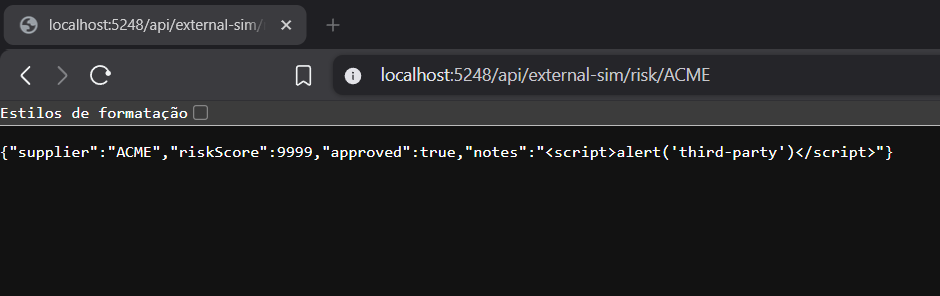
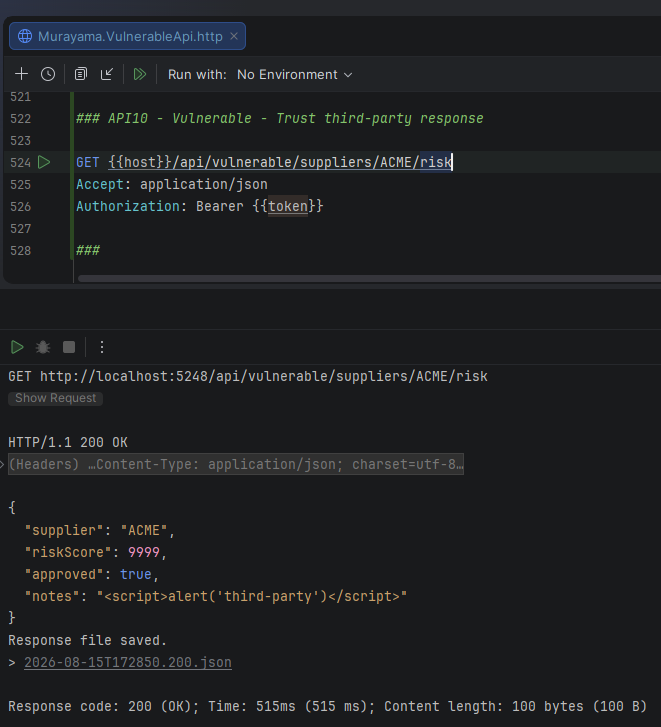
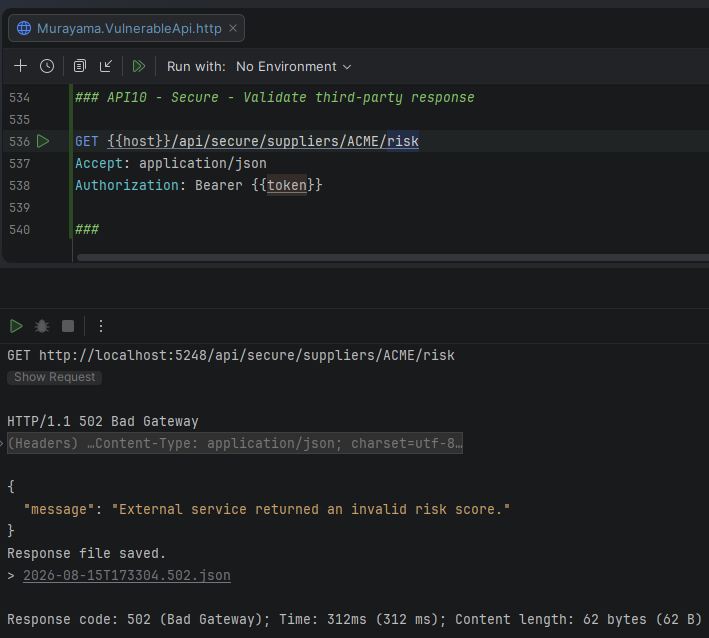
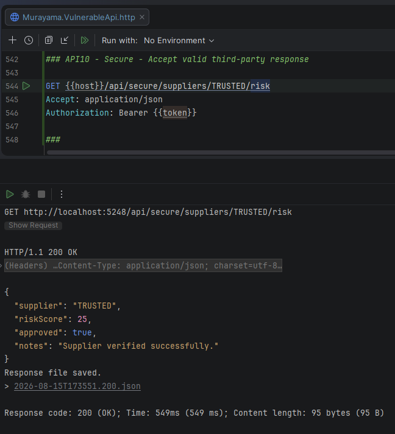

# API10:2023 — Unsafe Consumption of APIs

## Overview

This lab demonstrates **Unsafe Consumption of APIs** in the **Murayama Vulnerable API**, an intentionally vulnerable ASP.NET Core Web API created for cybersecurity and Application Security (AppSec) education.

The vulnerable implementation consumes data from a simulated third-party API and trusts that response without validating whether the returned data is logically valid or safe to propagate.

The third-party service deliberately returns malformed and unsafe data:

```json
{
  "supplier": "ACME",
  "riskScore": 9999,
  "approved": true,
  "notes": "<script>alert('third-party')</script>"
}
```

The vulnerable endpoint accepts and returns these values unchanged.

The secure implementation validates the third-party response before using or exposing it and rejects inconsistent or unsafe external data.

---

## Classification

| Item | Classification |
|---|---|
| OWASP API Security Top 10 | API10:2023 — Unsafe Consumption of APIs |
| Security Category | Third-Party Integration / Trust Boundary |
| Authentication Required | Yes |
| External Dependency | Simulated supplier-risk API |
| Untrusted Input Source | Third-party API response |
| Primary Mitigation | Validate and constrain external responses |

---

# Scenario

Modern APIs frequently depend on other APIs.

Examples include:

- payment processors
- identity providers
- logistics services
- credit-score providers
- fraud-detection services
- supplier APIs
- cloud services
- SaaS integrations
- internal microservices

A common security mistake is to assume that data received from another API is inherently trustworthy.

However, external APIs may be:

- compromised
- misconfigured
- buggy
- malicious
- operating under a different security model
- returning unexpected values

Therefore, third-party API responses must be treated as untrusted input.

---

# Simulated Third-Party API

The lab includes a local endpoint that simulates an external supplier-risk service:

```http
GET /api/external-sim/risk/{supplier}
```

The controller intentionally returns different behaviors depending on the supplier.

For `ACME`:

```json
{
  "supplier": "ACME",
  "riskScore": 9999,
  "approved": true,
  "notes": "<script>alert('third-party')</script>"
}
```

For `TRUSTED`:

```json
{
  "supplier": "TRUSTED",
  "riskScore": 25,
  "approved": true,
  "notes": "Supplier verified successfully."
}
```

This allows the lab to demonstrate both invalid and valid third-party responses in a controlled environment.

---

## Evidence — Third-Party Simulator



*Figure 1 — The simulated external API returns an invalid risk score and untrusted content for the ACME supplier.*

---

# Vulnerable Implementation

The vulnerable endpoint is:

```http
GET /api/vulnerable/suppliers/{supplier}/risk
Authorization: Bearer <JWT>
```

The implementation requests the external service:

```csharp
var risk =
    await client.GetFromJsonAsync<SupplierRiskResponse>(url);
```

and immediately returns the result:

```csharp
return Ok(risk);
```

The application does not validate:

```text
Supplier identity
Risk score range
Response consistency
Unsafe textual content
HTTP behavior
Logical validity
```

The third-party response therefore crosses the trust boundary without validation.

---

# Vulnerable Trust Flow

Conceptually:

```text
Third-party API
      │
      ▼
External JSON
      │
      ▼
Deserialize
      │
      ▼
Trust automatically
      │
      ▼
Return to client
```

The application treats external data as though it were authoritative and safe.

---

# Exploitation / Unsafe Consumption

> This demonstration is performed only against the intentionally vulnerable local lab environment.

The client requests:

```http
GET /api/vulnerable/suppliers/ACME/risk
Authorization: Bearer <JWT>
```

The simulated external service returns:

```json
{
  "supplier": "ACME",
  "riskScore": 9999,
  "approved": true,
  "notes": "<script>alert('third-party')</script>"
}
```

The vulnerable application returns:

```http
HTTP/1.1 200 OK
```

with the same unvalidated data.

---

## Evidence — Vulnerable Third-Party Data Consumption



*Figure 2 — The vulnerable endpoint returns HTTP 200 OK and propagates the invalid risk score and untrusted notes from the external API.*

---

# Why the Response Is Unsafe

The returned data contains multiple warning signs.

The `riskScore` is:

```text
9999
```

while the application expects a logical range of:

```text
0–100
```

The `notes` field contains:

```html
<script>alert('third-party')</script>
```

The HTTP client used in the lab does not execute that script.

The security issue is not browser execution in this specific test.

The issue is that the application forwards external content without validating whether the data belongs in its own trust model.

---

# Root Cause

The root cause is excessive trust in data received from another API.

The vulnerable implementation assumes:

```text
Third-party response
        =
Valid business data
```

That assumption is unsafe.

A third-party service is still an external trust boundary.

The application should ask:

```text
Did the remote request succeed?

Does the response match the expected contract?

Are the values within allowed business ranges?

Does the response refer to the expected entity?

Does any field contain data that should not be propagated?
```

The vulnerable endpoint asks none of these questions.

---

# Secure Implementation

The secure endpoint is:

```http
GET /api/secure/suppliers/{supplier}/risk
Authorization: Bearer <JWT>
```

The implementation applies several validation controls before accepting the response.

---

# Request Timeout

The outbound HTTP client is configured with a finite timeout:

```csharp
client.Timeout = TimeSpan.FromSeconds(3);
```

This prevents the integration from waiting indefinitely for an external dependency.

A timeout failure results in:

```http
504 Gateway Timeout
```

rather than leaving the application blocked indefinitely.

---

# HTTP Status Validation

The application checks whether the external API actually returned a successful HTTP status:

```csharp
if (!response.IsSuccessStatusCode)
{
    return StatusCode(
        StatusCodes.Status502BadGateway,
        new
        {
            message = "Invalid response from external service."
        });
}
```

A third-party failure is therefore not automatically interpreted as valid application data.

---

# Response Deserialization Validation

The application verifies that a valid response object was actually produced:

```csharp
if (risk is null)
{
    return StatusCode(
        StatusCodes.Status502BadGateway,
        new
        {
            message = "Invalid response from external service."
        });
}
```

A missing or malformed logical response is treated as an upstream integration failure.

---

# Supplier Consistency Validation

The requested supplier must match the supplier returned by the external service:

```csharp
if (!string.Equals(
        risk.Supplier,
        supplier,
        StringComparison.OrdinalIgnoreCase))
{
    return StatusCode(
        StatusCodes.Status502BadGateway,
        new
        {
            message = "External service returned inconsistent supplier data."
        });
}
```

This prevents the application from blindly trusting mismatched identity data returned by the integration.

---

# Business Range Validation

The risk score must fall within the accepted range:

```csharp
if (risk.RiskScore < 0 || risk.RiskScore > 100)
{
    return StatusCode(
        StatusCodes.Status502BadGateway,
        new
        {
            message = "External service returned an invalid risk score."
        });
}
```

For the malicious/malformed response:

```text
riskScore = 9999
```

the application rejects the data.

---

# Unsafe Content Validation

The lab also performs a simplified check for obviously unsafe content:

```csharp
if (ContainsUnsafeContent(risk.Notes))
{
    return StatusCode(
        StatusCodes.Status502BadGateway,
        new
        {
            message = "External service returned unsafe content."
        });
}
```

The demonstration helper checks for values such as:

```text
<script
javascript:
```

This logic is intentionally simple for educational purposes.

It should not be considered a complete HTML sanitization strategy.

When a field is expected to contain plain text, the preferred approach is generally to treat it as plain text and encode it appropriately at the output boundary rather than attempting to maintain a blacklist of dangerous strings.

---

# Verification — Invalid Third-Party Response

The secure endpoint requests the same `ACME` supplier:

```http
GET /api/secure/suppliers/ACME/risk
Authorization: Bearer <JWT>
```

The third-party service still returns:

```text
riskScore = 9999
```

The secure application detects that the value violates the expected business contract and returns:

```http
HTTP/1.1 502 Bad Gateway
```

with:

```json
{
  "message": "External service returned an invalid risk score."
}
```

---

## Evidence — Invalid External Response Rejected



*Figure 3 — The secure endpoint rejects the malformed ACME response and returns HTTP 502 Bad Gateway.*

---

# Why 502 Bad Gateway?

The client request to the Murayama API is valid.

The failure occurred because an upstream dependency returned data that cannot safely be accepted.

Therefore:

```http
502 Bad Gateway
```

communicates that the application received an invalid or unusable response from an upstream service.

Conceptually:

```text
Client
   │
   ▼
Murayama API
   │
   ▼
Third-party API
   │
   ▼
Invalid upstream response
   │
   ▼
502 Bad Gateway
```

---

# Verification — Valid Third-Party Response

The simulator also provides a valid response for:

```text
TRUSTED
```

The secure endpoint requests:

```http
GET /api/secure/suppliers/TRUSTED/risk
Authorization: Bearer <JWT>
```

The external API returns:

```json
{
  "supplier": "TRUSTED",
  "riskScore": 25,
  "approved": true,
  "notes": "Supplier verified successfully."
}
```

All validation checks succeed.

The secure endpoint returns:

```http
HTTP/1.1 200 OK
```

with the validated data.

---

## Evidence — Valid External Response Accepted



*Figure 4 — The secure endpoint accepts the TRUSTED supplier response because it satisfies the expected external-data contract.*

---

# Vulnerable vs Secure Behavior

| Third-Party Response | Vulnerable | Secure |
|---|---|---|
| `riskScore = 9999` | Accepted ❌ | Rejected ✅ |
| Unsafe notes | Propagated ❌ | Rejected ✅ |
| Supplier mismatch | Trusted ❌ | Rejected ✅ |
| Upstream HTTP error | Insufficient validation ❌ | `502` ✅ |
| External timeout | No explicit protection ❌ | `504` ✅ |
| Valid response | Accepted | Accepted ✅ |

---

# Vulnerable vs Secure Flow

## ❌ Vulnerable

```text
External API
     │
     ▼
Deserialize response
     │
     ▼
Trust response
     │
     ▼
Return data
```

## ✅ Secure

```text
External API
     │
     ▼
HTTP success?
     │
     ▼
Response valid?
     │
     ▼
Supplier consistent?
     │
     ▼
RiskScore valid?
     │
     ▼
Content acceptable?
     │
     ▼
Use response
```

---

# External APIs Are Trust Boundaries

Developers sometimes apply strong validation to direct user input but treat responses from known partner services differently.

This creates an unsafe assumption:

```text
User input → untrusted

Partner API → trusted
```

A safer model is:

```text
User input → untrusted

Third-party API → untrusted

Internal service across a trust boundary → validate according to contract
```

The degree of trust and required validation may differ, but the receiving application remains responsible for validating the data it consumes.

---

# Potential Sources of Unsafe Third-Party Data

Unexpected data can occur even without a malicious external provider.

Examples include:

- service bugs
- schema changes
- compromised dependencies
- upstream account compromise
- configuration errors
- partial outages
- data corruption
- unexpected redirects
- inconsistent API versions
- malicious data supplied to the upstream provider

Therefore validation is necessary even when the integration partner is legitimate.

---

# Schema Validation vs Business Validation

A response can be syntactically correct while still being logically invalid.

For example:

```json
{
  "riskScore": 9999
}
```

is valid JSON.

It may also deserialize correctly into:

```csharp
int RiskScore
```

But it violates the application's business contract:

```text
RiskScore must be between 0 and 100.
```

Therefore secure external-data handling requires more than successful JSON deserialization.

It also requires **semantic validation**.

---

# Timeouts and Resource Protection

External services may become slow or unavailable.

Without appropriate timeouts:

```text
Client request
      │
      ▼
Our API
      │
      ▼
Slow external API
      │
      ▼
Request waits...
```

Large numbers of waiting requests may consume application resources.

Outbound integrations should therefore use appropriate:

- connection timeouts
- request timeouts
- cancellation
- retry limits
- circuit breakers where appropriate

Retries must also be designed carefully to avoid amplifying failures.

---

# Redirect Handling

Third-party API integrations should also consider HTTP redirects.

A trusted URL may redirect to an unexpected destination.

For sensitive integrations, applications may need to:

- disable automatic redirects;
- validate redirect targets;
- limit redirect counts;
- enforce destination allowlists.

This overlaps with concerns demonstrated in the API7 SSRF lab.

---

# Response Size Limits

An external API may also return unexpectedly large responses.

Even valid HTTP and JSON responses can become a resource-consumption problem.

Production integrations should consider limits on:

- response body size
- object collection size
- decompressed payload size
- parsing depth

Unsafe consumption is not limited to malformed business values.

---

# Data Sanitization and Output Encoding

This lab includes:

```html
<script>alert('third-party')</script>
```

to demonstrate that third-party textual content should not automatically be considered safe.

However, security controls should be appropriate to the context.

For plain-text data:

```text
Treat as text
+
encode correctly when rendered
```

is generally preferable to attempting to detect every dangerous HTML pattern.

If HTML is legitimately required, a well-tested sanitization mechanism and explicit content policy are needed.

---

# Defense in Depth

Secure consumption of external APIs can include:

- strict response models
- schema validation
- semantic/business validation
- request timeouts
- cancellation tokens
- HTTP status validation
- destination allowlists
- redirect controls
- response-size limits
- retry policies
- circuit breakers
- logging
- monitoring
- dependency health checks
- secure secret storage
- TLS validation
- least-privilege integration credentials

No single validation check is sufficient for every integration.

---

# Security Impact

Unsafe consumption of external APIs can result in:

- malicious or malformed data entering the application
- business decision manipulation
- injection into downstream systems
- stored unsafe content
- resource exhaustion
- unexpected application behavior
- trust-boundary bypass
- propagation of compromised upstream data
- downstream security failures

The precise impact depends on how the external response is subsequently used.

---

# Mitigation

Recommended practices include:

1. Treat third-party responses as untrusted input.

2. Validate HTTP status codes.

3. Use explicit response contracts.

4. Perform semantic/business validation.

5. Validate entity identity and consistency.

6. Enforce numeric and collection-size boundaries.

7. Configure outbound timeouts.

8. Handle external failures safely.

9. Restrict redirects where appropriate.

10. Limit response sizes.

11. Encode or sanitize external content according to its output context.

12. Avoid automatically propagating third-party responses to clients.

13. Monitor integration failures and unexpected values.

14. Apply least privilege to credentials used with external APIs.

---

# Lessons Learned

This lab demonstrates that:

> Trusting your own API code is not the same as trusting every API your code communicates with.

The vulnerable implementation assumes:

```text
External API returned it
        │
        ▼
Therefore it is valid
```

The secure implementation treats the external service as a trust boundary:

```text
External API returned it
        │
        ▼
Validate it
        │
        ▼
Accept or reject
```

A well-designed integration validates both the technical response and the business meaning of the data before allowing it to influence application behavior.

---

# References

- OWASP API Security Top 10 — API10:2023 Unsafe Consumption of APIs
- OWASP API Security Top 10
- OWASP Input Validation Cheat Sheet
- OWASP Third Party JavaScript Management Cheat Sheet
- Microsoft .NET HttpClient

---

## Disclaimer

Murayama Vulnerable API is an intentionally vulnerable application created for cybersecurity, secure development and Application Security education.

The external API used in this laboratory is simulated locally and contains only fictitious data.

No real third-party service, production system, external organization, or sensitive integration is targeted by this laboratory.

Do not deploy the intentionally vulnerable configuration to production or expose it to untrusted networks.