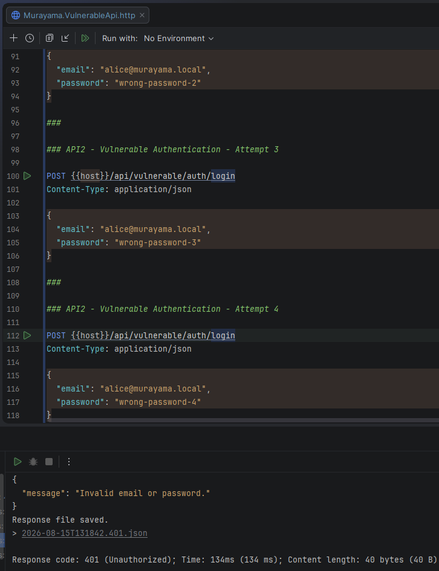
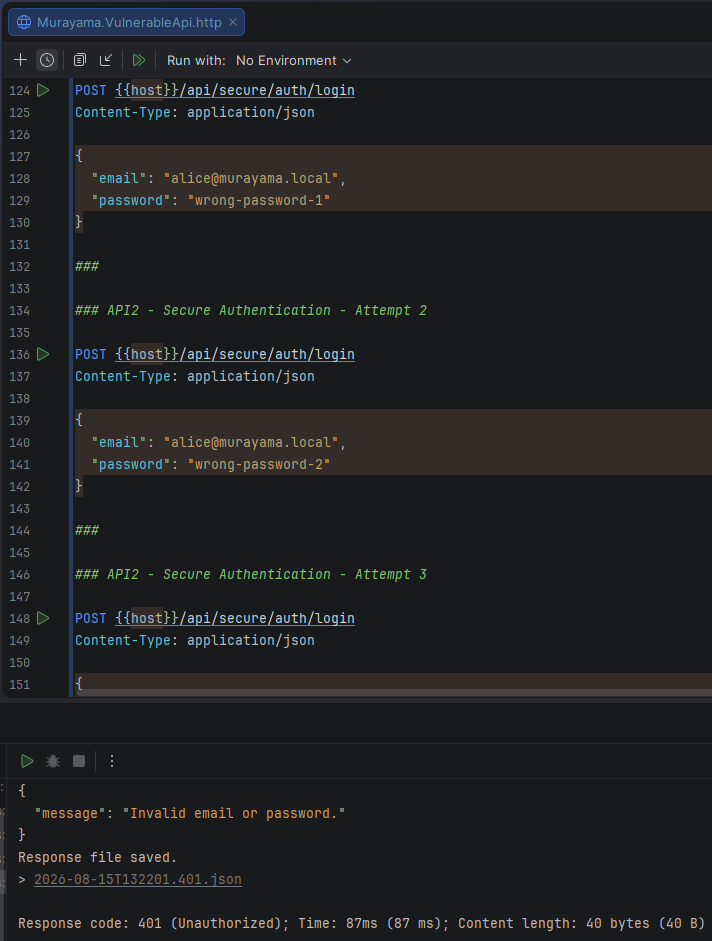
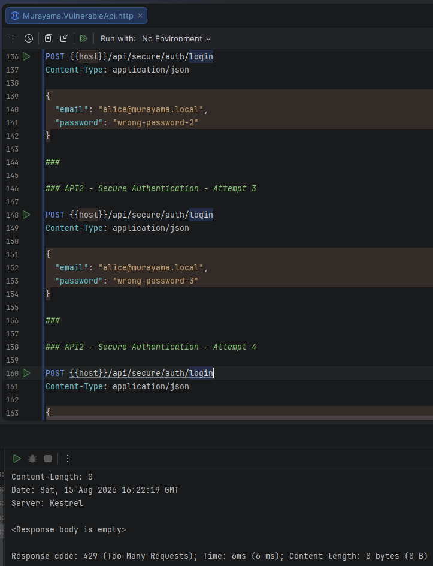

# API2:2023 — Broken Authentication

## Overview

This lab demonstrates a **Broken Authentication** scenario in the **Murayama Vulnerable API**, an intentionally vulnerable ASP.NET Core Web API created for cybersecurity and Application Security (AppSec) education.

The vulnerable login endpoint accepts repeated authentication attempts without any rate limiting or anti-automation control.

This behavior allows an attacker to continuously submit credentials against the authentication endpoint, increasing exposure to password guessing, brute-force attacks and credential stuffing.

The secure implementation applies rate limiting to the authentication endpoint and returns `429 Too Many Requests` after the configured threshold is exceeded.

---

## Classification

| Item | Classification |
|---|---|
| OWASP API Security Top 10 | API2:2023 — Broken Authentication |
| Security Category | Authentication |
| Authentication Required | No |
| Exploitation Complexity | Low |
| Primary Mitigation | Rate limiting / anti-automation controls |

---

## Vulnerable Endpoint

```http
POST /api/vulnerable/auth/login
```

The endpoint validates the supplied credentials and returns `401 Unauthorized` when authentication fails.

However, it does not restrict how frequently the endpoint can be called.

The implementation contains no rate limiting policy:

```csharp
[HttpPost("login")]
public async Task<ActionResult<LoginResponse>> Login(
    LoginRequest request)
{
    var user = await _dbContext.Users
        .SingleOrDefaultAsync(u => u.Email == request.Email);

    if (user is null ||
        !_passwordService.VerifyPassword(
            user,
            user.PasswordHash,
            request.Password))
    {
        return Unauthorized(new
        {
            message = "Invalid email or password."
        });
    }

    var token = _jwtService.GenerateToken(user);

    return Ok(new LoginResponse
    {
        AccessToken = token,
        ExpiresIn = _jwtSettings.ExpirationMinutes * 60
    });
}
```

The authentication logic itself works correctly, but there is no control over repeated attempts.

---

# Exploitation

> This demonstration is performed only against the intentionally vulnerable local lab environment.

Multiple invalid login attempts are sent to:

```http
POST /api/vulnerable/auth/login
```

Example:

```http
POST /api/vulnerable/auth/login
Content-Type: application/json

{
  "email": "alice@murayama.local",
  "password": "wrong-password-1"
}
```

The response is:

```http
HTTP/1.1 401 Unauthorized
```

The same endpoint continues processing additional attempts:

```text
Attempt 1 → 401 Unauthorized
Attempt 2 → 401 Unauthorized
Attempt 3 → 401 Unauthorized
Attempt 4 → 401 Unauthorized
```

No request is rejected due to excessive authentication attempts.

This means the endpoint can continue receiving repeated credential guesses without an application-level rate limit.

---

## Evidence — Vulnerable Endpoint



*Figure 1 — The vulnerable authentication endpoint continues processing repeated invalid login attempts without returning 429 Too Many Requests.*

---

# Root Cause

The root cause is the absence of an anti-automation control on the login endpoint.

Authentication endpoints are especially sensitive because they are intentionally exposed to unauthenticated users.

Without request throttling, an attacker may repeatedly submit combinations of usernames and passwords.

The vulnerable endpoint implements credential validation, but does not control request frequency.

Conceptually:

```text
POST /login
    │
    ▼
Check credentials
    │
    ├── invalid → 401
    │
    ▼
Request finished
    │
    ▼
Immediately accept another attempt
```

There is no mechanism that asks:

```text
Has this client already made too many authentication attempts?
```

---

# Secure Implementation

The secure endpoint is:

```http
POST /api/secure/auth/login
```

ASP.NET Core rate limiting is configured using a named policy:

```csharp
builder.Services.AddRateLimiter(options =>
{
    options.RejectionStatusCode =
        StatusCodes.Status429TooManyRequests;

    options.AddFixedWindowLimiter(
        "auth-login",
        limiterOptions =>
        {
            limiterOptions.PermitLimit = 3;
            limiterOptions.Window =
                TimeSpan.FromMinutes(1);

            limiterOptions.QueueLimit = 0;
            limiterOptions.AutoReplenishment = true;
        });
});
```

The middleware is enabled in the request pipeline:

```csharp
app.UseRateLimiter();
```

The secure authentication endpoint applies the policy:

```csharp
[HttpPost("login")]
[EnableRateLimiting("auth-login")]
public async Task<ActionResult<LoginResponse>> Login(
    LoginRequest request)
{
    // authentication logic
}
```

The configured behavior is:

```text
Maximum requests: 3
Window:           1 minute
Queue:            disabled
Rejected request: 429 Too Many Requests
```

---

# Verification of the Fix

The secure endpoint initially processes invalid credentials normally.

For example:

```text
Attempt 1 → 401 Unauthorized
Attempt 2 → 401 Unauthorized
Attempt 3 → 401 Unauthorized
```

This is expected.

The application is still validating credentials; it has simply not reached the configured request threshold yet.

---

## Evidence — Initial Secure Attempts



*Figure 2 — The first authentication attempts are processed normally and return 401 Unauthorized.*

---

## Rate Limit Triggered

The fourth request within the configured one-minute window is rejected before another authentication attempt is processed.

Result:

```http
HTTP/1.1 429 Too Many Requests
```

The client must wait until rate-limiter capacity becomes available again.

---

## Evidence — Rate Limiting



*Figure 3 — The secure login endpoint rejects the fourth request with 429 Too Many Requests.*

---

# Vulnerable vs Secure Behavior

| Attempt | Vulnerable Endpoint | Secure Endpoint |
|---:|---|---|
| 1 | `401 Unauthorized` | `401 Unauthorized` |
| 2 | `401 Unauthorized` | `401 Unauthorized` |
| 3 | `401 Unauthorized` | `401 Unauthorized` |
| 4 | `401 Unauthorized` ❌ | `429 Too Many Requests` ✅ |

The vulnerable endpoint continues validating credentials indefinitely.

The secure endpoint limits the request rate and eventually refuses additional authentication attempts.

---

# Vulnerable vs Secure Configuration

## ❌ Vulnerable

The endpoint has no rate limiting policy:

```csharp
[HttpPost("login")]
public async Task<ActionResult<LoginResponse>> Login(
    LoginRequest request)
```

There is no control over how frequently the endpoint can be called.

---

## ✅ Secure

The endpoint explicitly applies the authentication rate-limit policy:

```csharp
[HttpPost("login")]
[EnableRateLimiting("auth-login")]
public async Task<ActionResult<LoginResponse>> Login(
    LoginRequest request)
```

The application also has the corresponding policy registered through:

```csharp
builder.Services.AddRateLimiter(...);
```

---

# Security Impact

An authentication endpoint without appropriate anti-automation controls can increase exposure to attacks such as:

- password guessing
- brute-force attacks
- credential stuffing
- automated account takeover attempts
- excessive authentication traffic

If users reuse passwords from other services, credential stuffing can be particularly damaging because attackers may test credentials obtained from unrelated breaches.

Rate limiting does not eliminate these threats by itself, but it significantly reduces the rate at which automated attempts can be performed.

---

# Limitations of This Lab Mitigation

The secure implementation intentionally uses a simple fixed-window limiter for educational clarity.

The current policy is:

```text
3 requests per minute
```

and is applied to the endpoint as a whole.

A production system would usually require a more carefully designed strategy, potentially partitioned by factors such as:

- client IP address
- account identifier
- authenticated identity
- device/session characteristics
- combinations of account and network information

Additional controls may also include:

- progressive delays
- temporary account protection
- suspicious-login detection
- CAPTCHA or equivalent anti-automation mechanisms
- MFA
- credential-stuffing detection
- monitoring and alerting

Care must also be taken to avoid designing rate-limiting or account-lockout mechanisms that attackers can abuse to cause denial of service against legitimate users.

---

# Why 401 and 429 Mean Different Things

The two status codes represent different security decisions.

```http
401 Unauthorized
```

means:

> The submitted credentials were not accepted.

```http
429 Too Many Requests
```

means:

> The client has exceeded the permitted request rate.

In the secure implementation, the fourth attempt is not simply another failed password check. The request is rejected by the anti-automation control.

---

# Lessons Learned

This lab demonstrates that secure authentication involves more than verifying a username and password.

A login implementation can correctly:

- retrieve the user
- verify the password hash
- issue a signed JWT
- return generic authentication errors

and still expose a weakness if automated authentication attempts are unrestricted.

Authentication endpoints therefore require controls that consider not only **whether the credentials are valid**, but also **how the authentication mechanism is being used**.

---

# References

- OWASP API Security Top 10 — API2:2023 Broken Authentication
- ASP.NET Core Rate Limiting Middleware

---

## Disclaimer

Murayama Vulnerable API is an intentionally vulnerable application created for cybersecurity, secure development and Application Security education.

The vulnerable endpoints are designed to demonstrate security flaws in a controlled local environment.

Do not deploy the intentionally vulnerable configuration to production or expose it to untrusted networks.