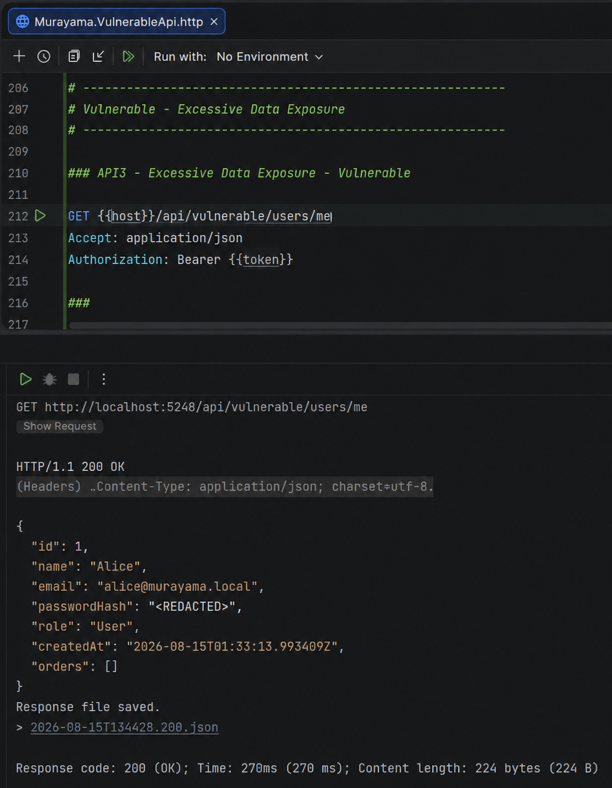
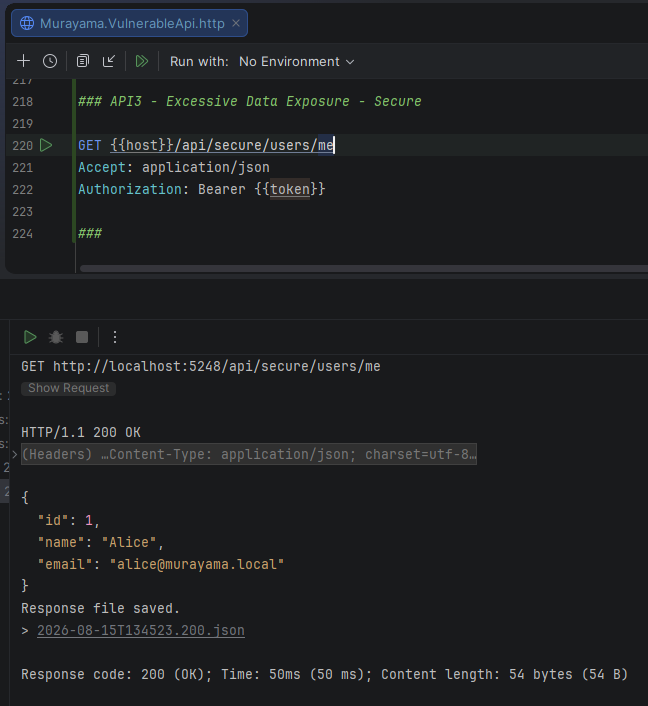
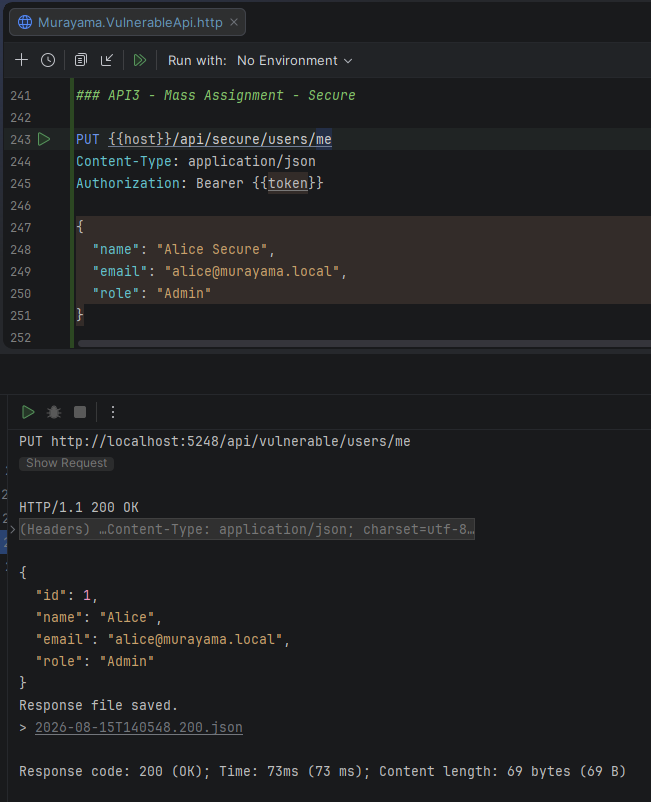
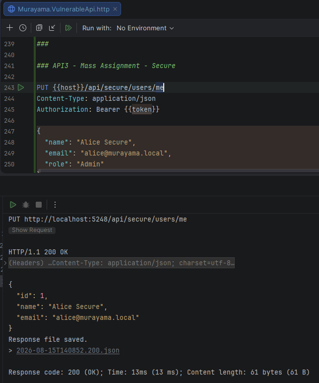
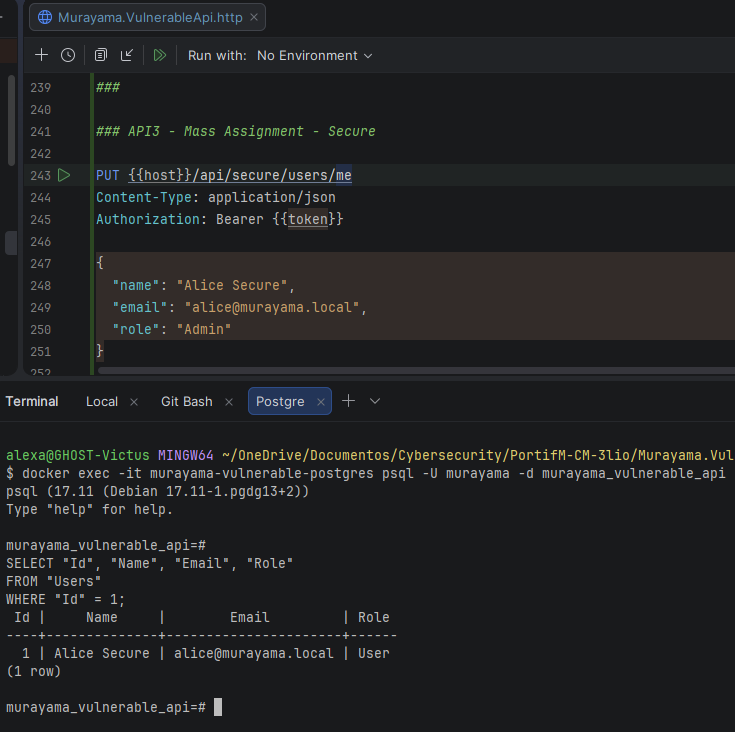

# API3:2023 — Broken Object Property Level Authorization (BOPLA)

## Overview

This lab demonstrates **Broken Object Property Level Authorization (BOPLA)** in the **Murayama Vulnerable API**, an intentionally vulnerable ASP.NET Core Web API created for cybersecurity and Application Security (AppSec) education.

The lab demonstrates two common property-level authorization failures:

1. **Excessive Data Exposure** — sensitive properties are returned to the client even though they are not required.
2. **Mass Assignment / Over-posting** — the client is allowed to modify properties that should only be controlled by the server.

Both vulnerabilities affect the `User` resource.

---

## Classification

| Item | Classification |
|---|---|
| OWASP API Security Top 10 | API3:2023 — Broken Object Property Level Authorization |
| Security Category | Authorization / Data Exposure |
| Authentication Required | Yes |
| Affected Resource | User |
| Demonstrated Issues | Excessive Data Exposure and Mass Assignment |

---

# Part 1 — Excessive Data Exposure

## Scenario

The application stores users using the following entity:

```csharp
public class User
{
    public int Id { get; set; }

    public required string Name { get; set; }

    public required string Email { get; set; }

    public required string PasswordHash { get; set; }

    public string Role { get; set; } = "User";

    public DateTime CreatedAt { get; set; }

    public ICollection<Order> Orders { get; set; }
}
```

Some of these properties are internal implementation details and should not be returned as part of a normal user-profile response.

For example:

```text
PasswordHash
Role
CreatedAt
Orders
```

The most sensitive property in this scenario is:

```text
PasswordHash
```

A password hash must remain server-side and should never be exposed through an API response.

---

# Vulnerable Implementation

## Endpoint

```http
GET /api/vulnerable/users/me
Authorization: Bearer <JWT>
```

The endpoint retrieves the authenticated user's complete database entity:

```csharp
var user = await _dbContext.Users
    .FirstOrDefaultAsync(u => u.Id == userId);
```

It then returns the entity directly:

```csharp
return Ok(user);
```

This causes ASP.NET Core's JSON serializer to serialize all publicly accessible properties.

Conceptually:

```text
Database User Entity
        │
        ▼
return Ok(user)
        │
        ▼
JSON serialization
        │
        ├── Id
        ├── Name
        ├── Email
        ├── PasswordHash   ❌
        ├── Role
        ├── CreatedAt
        └── Orders
```

The API does not explicitly decide which properties the client is authorized to receive.

---

# Exploitation

> This demonstration is performed only against the intentionally vulnerable local lab environment.

An authenticated Alice requests:

```http
GET /api/vulnerable/users/me
Authorization: Bearer <ALICE_JWT>
```

The endpoint returns:

```http
HTTP/1.1 200 OK
```

and includes internal properties.

Example:

```json
{
  "id": 1,
  "name": "Alice",
  "email": "alice@murayama.local",
  "passwordHash": "<REDACTED>",
  "role": "User",
  "createdAt": "2026-08-15T01:33:13.993409Z",
  "orders": []
}
```

The value of `passwordHash` is redacted in the documentation, but the vulnerable API returned the actual value during the controlled test.

---

## Evidence — Vulnerable Data Exposure



*Figure 1 — The vulnerable endpoint returns the complete User entity, including the PasswordHash property.*

---

# Root Cause — Excessive Data Exposure

The root cause is the use of a persistence entity as the API response contract.

The application performs:

```csharp
return Ok(user);
```

instead of explicitly defining which properties may be disclosed.

This creates tight coupling between:

```text
Database Model
      and
Public API Contract
```

Adding a new property to the database entity may therefore accidentally expose it through the API.

---

# Secure Implementation

The secure endpoint is:

```http
GET /api/secure/users/me
Authorization: Bearer <JWT>
```

A dedicated response DTO defines the properties that may be returned:

```csharp
public class UserProfileResponse
{
    public int Id { get; set; }

    public required string Name { get; set; }

    public required string Email { get; set; }
}
```

Sensitive/internal fields do not exist in the response model.

The database query also performs an explicit projection:

```csharp
var user = await _dbContext.Users
    .Where(u => u.Id == userId)
    .Select(u => new UserProfileResponse
    {
        Id = u.Id,
        Name = u.Name,
        Email = u.Email
    })
    .FirstOrDefaultAsync();
```

The resulting response contains only:

```text
Id
Name
Email
```

---

## Evidence — Secure Data Exposure



*Figure 2 — The secure endpoint uses a response DTO and no longer exposes PasswordHash, Role, CreatedAt or other internal properties.*

---

# Vulnerable vs Secure Output

## ❌ Vulnerable

```json
{
  "id": 1,
  "name": "Alice",
  "email": "alice@murayama.local",
  "passwordHash": "<REDACTED>",
  "role": "User",
  "createdAt": "...",
  "orders": []
}
```

## ✅ Secure

```json
{
  "id": 1,
  "name": "Alice",
  "email": "alice@murayama.local"
}
```

The secure implementation uses an explicit **property allowlist** through the DTO.

---

# Part 2 — Mass Assignment / Over-posting

## Scenario

Alice is a standard application user:

```text
Id   = 1
Role = User
```

The application allows users to update their profile.

A legitimate user should be allowed to modify properties such as:

```text
Name
Email
```

However, the following properties must remain server-controlled:

```text
Role
PasswordHash
Id
CreatedAt
```

In particular, users must never be able to promote themselves from:

```text
User
```

to:

```text
Admin
```

by modifying the request body.

---

# Vulnerable Implementation

The vulnerable endpoint accepts the database entity directly as input:

```csharp
[HttpPut("me")]
public async Task<IActionResult> UpdateCurrentUser(User input)
```

The request is therefore bound to a `User` object.

The implementation then performs:

```csharp
user.Name = input.Name;
user.Email = input.Email;
user.Role = input.Role;
```

The vulnerable line is:

```csharp
user.Role = input.Role;
```

The client is able to supply a property that should only be controlled by the server.

---

# Exploitation — Mass Assignment

Alice sends:

```http
PUT /api/vulnerable/users/me
Authorization: Bearer <ALICE_JWT>
Content-Type: application/json
```

with:

```json
{
  "name": "Alice",
  "email": "alice@murayama.local",
  "role": "Admin",
  "passwordHash": "ignored-by-this-endpoint"
}
```

Alice is authenticated as a normal user.

No authentication bypass occurs.

However, the vulnerable endpoint accepts:

```json
"role": "Admin"
```

and assigns it to the persisted entity.

The response demonstrates that the role was changed:

```json
{
  "id": 1,
  "name": "Alice",
  "email": "alice@murayama.local",
  "role": "Admin"
}
```

Alice has modified a privileged server-controlled property.

---

## Evidence — Vulnerable Mass Assignment



*Figure 3 — The vulnerable endpoint accepts the Role property from the client and changes Alice from User to Admin.*

---

# Root Cause — Mass Assignment

The vulnerable design uses the persistence entity as an input model:

```csharp
UpdateCurrentUser(User input)
```

This exposes properties that should never be controlled through this operation.

Conceptually:

```text
Client JSON
    │
    ▼
User entity
    │
    ├── Name
    ├── Email
    ├── Role          ❌
    ├── PasswordHash  ❌
    ├── Id            ❌
    └── CreatedAt     ❌
```

Even if only some properties are eventually assigned, exposing the entire entity as the request contract makes sensitive-property mistakes significantly easier.

---

# Secure Implementation — Input DTO

The secure endpoint uses a dedicated request DTO:

```csharp
public class UpdateUserProfileRequest
{
    public required string Name { get; set; }

    public required string Email { get; set; }
}
```

Notice that the following properties do not exist:

```text
Role
PasswordHash
Id
CreatedAt
```

The secure endpoint accepts:

```csharp
[HttpPut("me")]
public async Task<IActionResult> UpdateCurrentUser(
    UpdateUserProfileRequest request)
```

and explicitly assigns only permitted properties:

```csharp
user.Name = request.Name;
user.Email = request.Email;
```

There is no:

```csharp
request.Role
```

because `Role` is intentionally excluded from the input contract.

This creates an explicit allowlist of properties that the user may modify.

---

# Attempting Mass Assignment Against the Secure Endpoint

Alice attempts to send:

```http
PUT /api/secure/users/me
Authorization: Bearer <ALICE_JWT>
Content-Type: application/json
```

with:

```json
{
  "name": "Alice Secure",
  "email": "alice@murayama.local",
  "role": "Admin"
}
```

The client still sends:

```json
"role": "Admin"
```

but the request DTO contains no `Role` property.

Therefore this value cannot be used by the controller to modify the user's role.

The legitimate property:

```text
Name
```

is updated successfully.

The privileged property:

```text
Role
```

remains unchanged.

---

## Evidence — Secure Mass Assignment Protection



*Figure 4 — The client sends Role = Admin, but the secure endpoint's DTO only allows Name and Email to be updated.*

---

# Database Verification

After the secure update, the PostgreSQL database is queried directly.

The persisted user remains:

```text
Name = Alice Secure
Role = User
```

This proves that although the client attempted to submit:

```json
"role": "Admin"
```

the privileged property was not modified.

---

## Evidence — PostgreSQL Verification



*Figure 5 — PostgreSQL confirms that the legitimate Name change was persisted while Alice's Role remained User.*

---

# Mass Assignment Behavior Comparison

| Property | Vulnerable Endpoint | Secure Endpoint |
|---|---|---|
| Name | Editable | Editable |
| Email | Editable | Editable |
| Role | Editable ❌ | Not exposed ✅ |
| PasswordHash | Entity exposes property ❌ | Not exposed ✅ |
| Id | Entity exposes property ❌ | Not exposed ✅ |
| CreatedAt | Entity exposes property ❌ | Not exposed ✅ |

---

# Overall API3 Comparison

| Scenario | Vulnerable | Secure |
|---|---|---|
| Profile response | Entire EF entity | Explicit response DTO |
| PasswordHash exposed | Yes ❌ | No ✅ |
| Client input type | `User` entity | `UpdateUserProfileRequest` |
| Role accepted as editable property | Yes ❌ | No ✅ |
| Property selection | Implicit | Explicit allowlist |

---

# Security Impact

Broken Object Property Level Authorization can result in both unauthorized data disclosure and unauthorized modification of sensitive properties.

Possible impacts include:

- exposure of password hashes
- disclosure of internal account metadata
- exposure of privileged flags
- unauthorized role modification
- account privilege escalation
- modification of ownership information
- modification of financial or business-sensitive attributes
- exposure of internal-only application fields

The exact impact depends on which properties are incorrectly exposed or writable.

---

# Mitigation

Applications should explicitly control which properties can be read and written by each API operation.

Recommended practices include:

1. Do not expose database entities directly as public API contracts.

2. Use dedicated DTOs for request and response models.

3. Define explicit allowlists of readable and writable properties.

4. Treat authorization at the property level separately from authorization at the object level.

5. Never trust privileged properties supplied by the client.

6. Keep server-controlled fields out of client-facing update models.

7. Review serialization behavior whenever new properties are added to persistence entities.

8. Test APIs for both excessive property disclosure and unauthorized property modification.

---

# Important Distinction: BOLA vs BOPLA

The previous API1 lab demonstrated **object-level authorization**.

Example:

```text
Can Alice access Bob's Order 3?
```

API3 focuses on **property-level authorization**.

Examples:

```text
Should Alice receive PasswordHash?
```

or:

```text
Should Alice be allowed to modify Role?
```

Therefore:

```text
BOLA
│
└── Which objects can the user access?

BOPLA
│
└── Which properties of an object can the user read or modify?
```

Both controls may be required simultaneously.

---

# Lessons Learned

This lab demonstrates that API authorization must operate at more than one level.

It is not sufficient to determine whether a user may access a `User` object.

The application must also decide:

```text
Which properties may the user READ?
```

and:

```text
Which properties may the user WRITE?
```

Using dedicated request and response DTOs creates explicit API contracts and significantly reduces the risk of unintentionally exposing or accepting sensitive properties.

---

# References

- OWASP API Security Top 10 — API3:2023 Broken Object Property Level Authorization
- CWE-200 — Exposure of Sensitive Information to an Unauthorized Actor
- CWE-915 — Improperly Controlled Modification of Dynamically-Determined Object Attributes

---

## Disclaimer

Murayama Vulnerable API is an intentionally vulnerable application created for cybersecurity, secure development and Application Security education.

The vulnerable endpoints are designed to demonstrate security flaws in a controlled local environment.

Do not deploy the intentionally vulnerable configuration to production or expose it to untrusted networks.