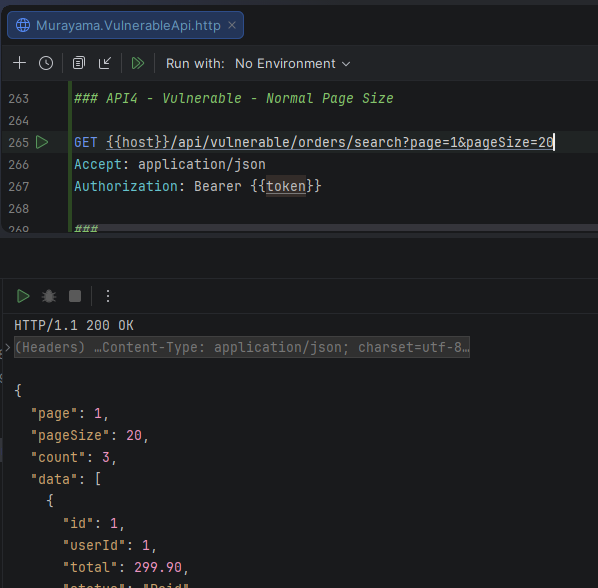
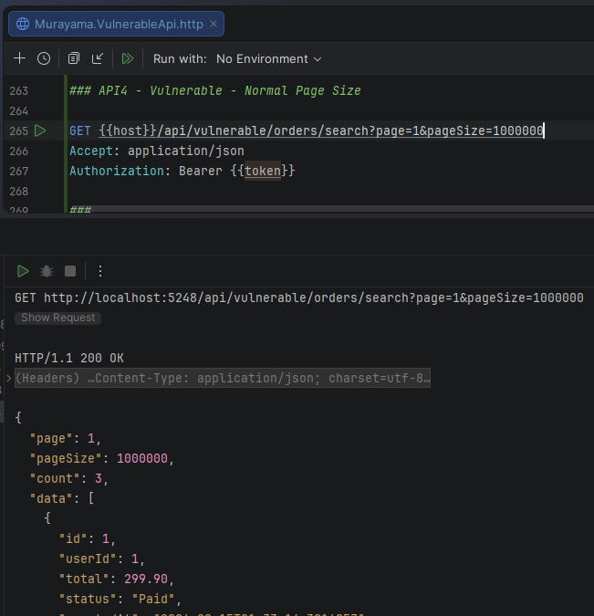
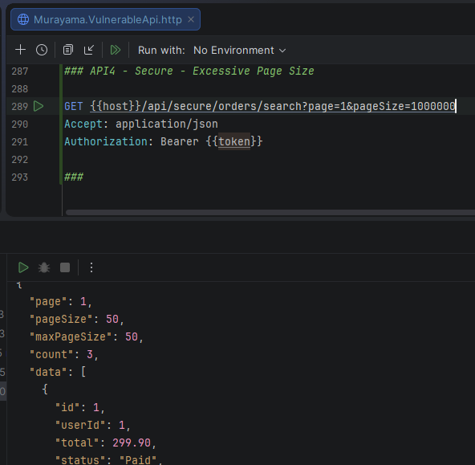

# API4:2023 — Unrestricted Resource Consumption

## Overview

This lab demonstrates **Unrestricted Resource Consumption** in the **Murayama Vulnerable API**, an intentionally vulnerable ASP.NET Core Web API created for cybersecurity and Application Security (AppSec) education.

The vulnerable endpoint implements client-controlled pagination without enforcing a maximum page size.

As a result, the client can request an arbitrarily large number of records:

```text
?pageSize=1000000
```

and the application uses that value directly when building the database query.

The secure implementation enforces a server-side maximum page size, ensuring that clients cannot determine an unrestricted resource-consumption limit.

---

## Classification

| Item | Classification |
|---|---|
| OWASP API Security Top 10 | API4:2023 — Unrestricted Resource Consumption |
| Security Category | Resource Management |
| Authentication Required | Yes |
| Affected Resource | Orders |
| Vulnerable Parameter | `pageSize` |
| Primary Mitigation | Server-side resource limits |

---

# Scenario

The API provides an endpoint that allows authenticated users to retrieve orders using pagination.

A typical request may use:

```http
GET /api/vulnerable/orders/search?page=1&pageSize=20
```

Pagination itself is not a vulnerability.

The security issue occurs when the application allows the client to freely control the amount of data requested without enforcing an upper bound.

For example:

```text
pageSize=20
pageSize=100
pageSize=10000
pageSize=1000000
```

If the server accepts all these values, the client effectively influences how much work the application may attempt to perform.

---

# Vulnerable Implementation

## Endpoint

```http
GET /api/vulnerable/orders/search
```

The vulnerable endpoint receives the pagination parameters directly from the query string:

```csharp
[HttpGet("search")]
public async Task<IActionResult> Search(
    [FromQuery] int page = 1,
    [FromQuery] int pageSize = 20)
```

Basic validation handles invalid negative or zero values:

```csharp
if (page < 1)
    page = 1;

if (pageSize < 1)
    pageSize = 20;
```

However, no maximum value is defined.

The value supplied by the client is then used directly:

```csharp
.Skip((page - 1) * pageSize)
.Take(pageSize)
```

The critical issue is:

```csharp
.Take(pageSize)
```

because `pageSize` is client-controlled and has no server-side upper limit.

---

# Normal Request

A normal client request might be:

```http
GET /api/vulnerable/orders/search?page=1&pageSize=20
Authorization: Bearer <JWT>
```

The API accepts:

```text
pageSize = 20
```

and returns the available records.

---

## Evidence — Normal Page Size



*Figure 1 — A normal request uses pageSize=20 and is processed by the vulnerable endpoint.*

---

# Excessive Resource Request

> This demonstration is performed only against the intentionally vulnerable local lab environment.

The client can instead submit:

```http
GET /api/vulnerable/orders/search?page=1&pageSize=1000000
Authorization: Bearer <JWT>
```

The application accepts:

```text
pageSize = 1000000
```

without applying a maximum server-side limit.

The response confirms the effective value:

```json
{
  "page": 1,
  "pageSize": 1000000,
  "count": 3,
  "data": [...]
}
```

The laboratory database currently contains only a small number of orders, so this request does not actually return one million records.

However, the security issue is the absence of a resource-consumption policy.

The application has accepted an arbitrarily large client-controlled value and used it to construct the query.

---

## Evidence — Excessive Page Size



*Figure 2 — The vulnerable endpoint accepts pageSize=1000000 without enforcing an upper bound.*

---

# Root Cause

The root cause is insufficient server-side validation of a parameter that influences resource consumption.

The vulnerable implementation validates only the lower boundary:

```text
pageSize < 1
```

but does not validate the upper boundary:

```text
pageSize > MAXIMUM_ALLOWED
```

Conceptually:

```text
Client
  │
  │ pageSize=1000000
  ▼
API Controller
  │
  │ no maximum validation
  ▼
Take(1000000)
  │
  ▼
Database Query
```

The client therefore controls a parameter that can influence the amount of work performed by the application.

---

# Potential Resource Impact

Large or repeated requests can potentially increase consumption across several components:

```text
Database
   │
   ▼
Query execution
   │
   ▼
Application memory
   │
   ▼
Object materialization
   │
   ▼
JSON serialization
   │
   ▼
Network bandwidth
   │
   ▼
Client response
```

Depending on the application and dataset, unrestricted requests may consume:

- database resources
- CPU
- application memory
- network bandwidth
- connection-pool capacity
- request-processing time

Repeated abusive requests can amplify these effects.

---

# Secure Implementation

The secure endpoint is:

```http
GET /api/secure/orders/search
```

The server defines explicit pagination limits:

```csharp
const int defaultPageSize = 20;
const int maxPageSize = 50;
```

Invalid small values are normalized:

```csharp
if (pageSize < 1)
    pageSize = defaultPageSize;
```

More importantly, excessive values are restricted:

```csharp
if (pageSize > maxPageSize)
    pageSize = maxPageSize;
```

The database query then uses the server-approved value:

```csharp
.Skip((page - 1) * pageSize)
.Take(pageSize)
```

The client may request any value, but the server retains control over the effective resource limit.

---

# Verification of the Fix

The client attempts exactly the same excessive value:

```http
GET /api/secure/orders/search?page=1&pageSize=1000000
Authorization: Bearer <JWT>
```

The request contains:

```text
pageSize = 1000000
```

but the server applies:

```text
maxPageSize = 50
```

The effective response therefore reports:

```json
{
  "page": 1,
  "pageSize": 50,
  "maxPageSize": 50,
  "count": 3,
  "data": [...]
}
```

The client requested one million records per page, but the server limited the effective page size to 50.

---

## Evidence — Server-Side Page Limit



*Figure 3 — The client requests pageSize=1000000, but the secure endpoint enforces maxPageSize=50.*

---

# Vulnerable vs Secure Behavior

| Client Request | Vulnerable Endpoint | Secure Endpoint |
|---|---:|---:|
| `pageSize=20` | 20 | 20 |
| `pageSize=50` | 50 | 50 |
| `pageSize=100` | 100 ❌ | 50 ✅ |
| `pageSize=10000` | 10000 ❌ | 50 ✅ |
| `pageSize=1000000` | 1000000 ❌ | 50 ✅ |

The vulnerable endpoint trusts the client to determine the resource limit.

The secure endpoint defines the limit as part of server-side policy.

---

# Vulnerable vs Secure Flow

## ❌ Vulnerable

```text
Client
  │
  │ pageSize=1000000
  ▼
Controller
  │
  │ accepts value
  ▼
Take(1000000)
```

## ✅ Secure

```text
Client
  │
  │ pageSize=1000000
  ▼
Controller
  │
  ├── requested: 1000000
  │
  └── maximum:   50
          │
          ▼
     pageSize=50
          │
          ▼
       Take(50)
```

---

# Why a Small Lab Database Still Demonstrates the Vulnerability

The laboratory contains only a small number of orders.

Therefore:

```text
Take(1000000)
```

does not cause the database to return one million records when only three exist.

This does not eliminate the underlying security weakness.

The vulnerable behavior is that the server accepts an unrestricted client-controlled resource parameter.

In a production environment with a significantly larger dataset, the same design could result in substantially greater resource consumption.

The lab intentionally demonstrates the insecure control flow without attempting to exhaust resources or cause denial of service.

---

# Why the Lab Does Not Perform a Real DoS Test

The purpose of this lab is to demonstrate the vulnerable design and its mitigation.

It is not necessary to:

- generate millions of database records
- intentionally exhaust application memory
- saturate the database
- generate excessive network traffic
- crash the API

The vulnerability can be demonstrated safely by proving that the server accepts an excessive resource-consumption parameter without enforcing an upper bound.

---

# Alternative Secure Behavior

This lab uses **clamping**.

For example:

```text
Client requests: 1000000
Server maximum:  50
Effective value: 50
```

Another valid API design could reject excessive values:

```http
HTTP/1.1 400 Bad Request
```

with a response such as:

```json
{
  "error": "pageSize cannot exceed 50."
}
```

Both approaches ensure that the server, rather than the client, controls the maximum permitted resource consumption.

The appropriate behavior depends on the API contract and application requirements.

---

# Defense in Depth

Pagination limits are only one resource-control mechanism.

Production APIs may require additional controls such as:

- request rate limiting
- request body size limits
- upload size limits
- query execution timeouts
- database command timeouts
- concurrency limits
- memory constraints
- CPU constraints
- infrastructure quotas
- response-size limits
- cost or billing limits for external services
- monitoring and alerting

Rate limiting and pagination limits address different dimensions.

For example:

```text
Pagination limit
    └── How expensive can one request become?

Rate limiting
    └── How frequently can requests be made?
```

A robust API may require both.

---

# Security Impact

Unrestricted Resource Consumption can potentially result in:

- degraded application performance
- increased infrastructure costs
- database resource exhaustion
- excessive memory consumption
- excessive CPU utilization
- bandwidth consumption
- service degradation
- denial of service

The exact impact depends on the affected operation and the resources it consumes.

---

# Mitigation

Recommended practices include:

1. Define server-side minimum and maximum pagination values.

2. Never allow clients to define unrestricted query limits.

3. Apply rate limiting where appropriate.

4. Limit request and upload sizes.

5. Configure database and request timeouts.

6. Apply infrastructure-level CPU and memory limits.

7. Monitor unusually expensive requests.

8. Consider the cost of downstream services triggered by API requests.

9. Validate all client-controlled parameters that influence resource consumption.

10. Perform load and resilience testing in controlled environments.

---

# Lessons Learned

This lab demonstrates an important API security principle:

> Client input should not determine unrestricted server resource consumption.

A parameter may appear harmless:

```text
pageSize
```

but it directly influences the amount of work an application may perform.

Input validation therefore involves more than checking data types and syntax.

The application must also enforce **business and operational boundaries**.

The vulnerable implementation asks:

```text
Is pageSize a positive integer?
```

The secure implementation additionally asks:

```text
Is pageSize within the amount of work this server is willing to perform?
```

That distinction is the core lesson of this laboratory.

---

# References

- OWASP API Security Top 10 — API4:2023 Unrestricted Resource Consumption
- CWE-400 — Uncontrolled Resource Consumption
- CWE-770 — Allocation of Resources Without Limits or Throttling

---

## Disclaimer

Murayama Vulnerable API is an intentionally vulnerable application created for cybersecurity, secure development and Application Security education.

The vulnerable endpoints are designed to demonstrate security flaws in a controlled local environment.

Do not deploy the intentionally vulnerable configuration to production or expose it to untrusted networks.