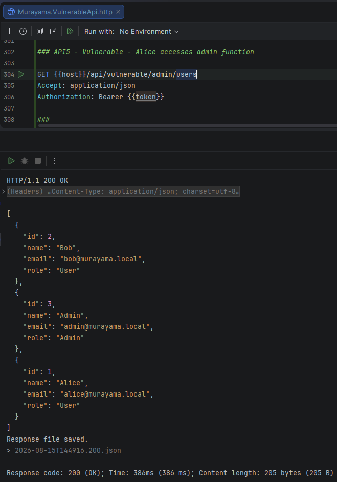
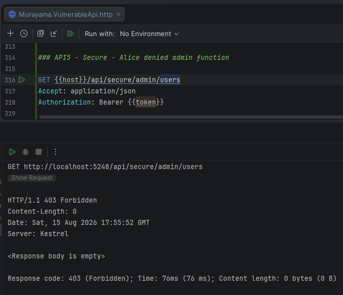
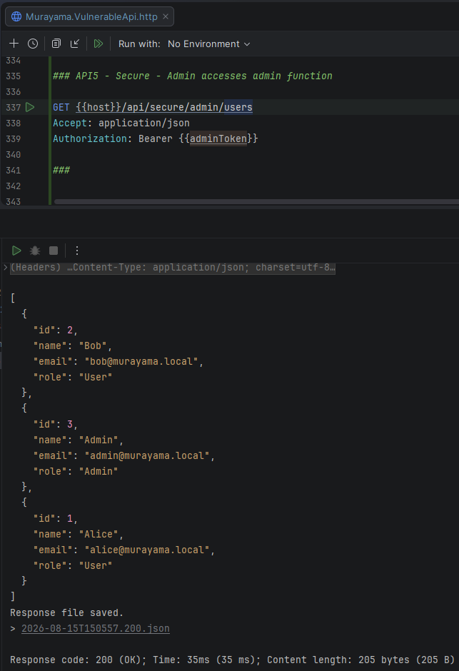

# API5:2023 — Broken Function Level Authorization (BFLA)

## Overview

This lab demonstrates **Broken Function Level Authorization (BFLA)** in the **Murayama Vulnerable API**, an intentionally vulnerable ASP.NET Core Web API created for cybersecurity and Application Security (AppSec) education.

The vulnerable implementation protects an administrative endpoint with authentication, but does not verify whether the authenticated user has the required administrative role.

As a result, a normal authenticated user can access functionality intended only for administrators.

The secure implementation enforces role-based authorization and restricts the administrative function to users with the `Admin` role.

---

## Classification

| Item | Classification |
|---|---|
| OWASP API Security Top 10 | API5:2023 — Broken Function Level Authorization |
| Security Category | Authorization |
| Authentication Required | Yes |
| Privileged Function | List all users |
| Required Role | Admin |
| Primary Mitigation | Role-based authorization |

---

# Scenario

The application provides an administrative function that lists all registered users.

The endpoint returns information such as:

```text
Id
Name
Email
Role
```

Because this is an administrative operation, normal application users should not be able to execute it.

The expected authorization model is:

```text
User  → Denied
Admin → Allowed
```

However, the vulnerable implementation verifies only whether the caller is authenticated.

---

# Vulnerable Endpoint

```http
GET /api/vulnerable/admin/users
Authorization: Bearer <JWT>
```

The controller uses:

```csharp
[Authorize]
```

Example:

```csharp
[ApiController]
[Route("api/vulnerable/admin")]
[Authorize]
public class VulnerableAdminController : ControllerBase
{
    private readonly AppDbContext _dbContext;

    public VulnerableAdminController(AppDbContext dbContext)
    {
        _dbContext = dbContext;
    }

    [HttpGet("users")]
    public async Task<IActionResult> GetUsers()
    {
        var users = await _dbContext.Users
            .AsNoTracking()
            .Select(u => new
            {
                u.Id,
                u.Name,
                u.Email,
                u.Role
            })
            .ToListAsync();

        return Ok(users);
    }
}
```

The endpoint requires authentication but does not require administrative privileges.

---

# Root Cause

The vulnerable authorization rule is:

```csharp
[Authorize]
```

This answers only:

```text
Is the caller authenticated?
```

It does not answer:

```text
Is the caller authorized to execute this administrative function?
```

Therefore both of these users satisfy the requirement:

```text
Alice
Role = User
Authenticated = Yes
        │
        └── [Authorize] ✓

Admin
Role = Admin
Authenticated = Yes
        │
        └── [Authorize] ✓
```

The application fails to distinguish between normal and privileged functionality.

---

# Exploitation

> This demonstration is performed only against the intentionally vulnerable local lab environment.

Alice is authenticated with:

```text
Role = User
```

She sends:

```http
GET /api/vulnerable/admin/users
Authorization: Bearer <ALICE_JWT>
```

Although Alice is not an administrator, the request succeeds:

```http
HTTP/1.1 200 OK
```

and the administrative user list is returned.

Example:

```json
[
  {
    "id": 1,
    "name": "Alice",
    "email": "alice@murayama.local",
    "role": "User"
  },
  {
    "id": 2,
    "name": "Bob",
    "email": "bob@murayama.local",
    "role": "User"
  },
  {
    "id": 3,
    "name": "Admin",
    "email": "admin@murayama.local",
    "role": "Admin"
  }
]
```

The vulnerability is not an authentication bypass.

Alice has a valid account and valid JWT.

The problem is that her authorization level is insufficient for the function being executed, but the application does not enforce that distinction.

---

## Evidence — Unauthorized Administrative Access



*Figure 1 — Alice has the User role but successfully accesses the administrative user-listing function and receives HTTP 200 OK.*

---

# Secure Implementation

The secure endpoint is:

```http
GET /api/secure/admin/users
Authorization: Bearer <JWT>
```

The controller explicitly requires the `Admin` role:

```csharp
[Authorize(Roles = "Admin")]
```

Example:

```csharp
[ApiController]
[Route("api/secure/admin")]
[Authorize(Roles = "Admin")]
public class SecureAdminController : ControllerBase
{
    private readonly AppDbContext _dbContext;

    public SecureAdminController(AppDbContext dbContext)
    {
        _dbContext = dbContext;
    }

    [HttpGet("users")]
    public async Task<IActionResult> GetUsers()
    {
        var users = await _dbContext.Users
            .AsNoTracking()
            .Select(u => new
            {
                u.Id,
                u.Name,
                u.Email,
                u.Role
            })
            .ToListAsync();

        return Ok(users);
    }
}
```

The authorization requirement now evaluates both authentication and role membership.

---

# Verification — Normal User

Alice sends the same type of request to the secure endpoint:

```http
GET /api/secure/admin/users
Authorization: Bearer <ALICE_JWT>
```

Alice is:

```text
Authenticated = Yes
Role = User
```

The application evaluates:

```text
[Authorize(Roles = "Admin")]

Authenticated? → Yes
Admin?         → No
```

The request is rejected:

```http
HTTP/1.1 403 Forbidden
```

---

## Evidence — Normal User Denied



*Figure 2 — Alice is authenticated but does not have the Admin role, so the secure endpoint returns HTTP 403 Forbidden.*

---

# Verification — Administrator

The administrative account has:

```text
Role = Admin
```

A JWT is obtained for the Admin user and used against exactly the same secure endpoint:

```http
GET /api/secure/admin/users
Authorization: Bearer <ADMIN_JWT>
```

The authorization evaluation becomes:

```text
Authenticated? → Yes
Admin?         → Yes
```

The request succeeds:

```http
HTTP/1.1 200 OK
```

and the administrative functionality remains available to the correct user.

---

## Evidence — Administrator Allowed



*Figure 3 — A user with the Admin role successfully accesses the secure administrative endpoint and receives HTTP 200 OK.*

---

# Vulnerable vs Secure Behavior

| Caller | Role | Vulnerable Endpoint | Secure Endpoint |
|---|---|---|---|
| Alice | User | `200 OK` ❌ | `403 Forbidden` ✅ |
| Admin | Admin | `200 OK` | `200 OK` ✅ |

The vulnerable implementation asks only whether the caller is authenticated.

The secure implementation additionally verifies whether the caller is authorized to perform the administrative function.

---

# Authentication vs Authorization

This lab demonstrates an important distinction between authentication and authorization.

## Authentication

Authentication answers:

```text
Who are you?
```

For example:

```text
JWT valid
    │
    ▼
Alice
```

Alice successfully authenticates.

---

## Authorization

Authorization answers:

```text
What are you allowed to do?
```

For example:

```text
Alice
Role = User
    │
    ▼
Administrative function?
    │
    ▼
No
```

A valid JWT does not automatically authorize access to every API function.

---

# 401 vs 403

The secure behavior also demonstrates the difference between two HTTP status codes.

## 401 Unauthorized

Typically indicates that valid authentication credentials were not provided.

Examples:

```text
Missing JWT
Invalid JWT
Expired JWT
```

Conceptually:

```text
Who are you?
    │
    └── Cannot establish identity
```

---

## 403 Forbidden

Indicates that the identity is known, but the caller lacks permission to perform the requested operation.

In this lab:

```text
Alice
    │
    ├── JWT valid ✓
    ├── Authenticated ✓
    └── Role = User
             │
             ▼
       Admin function
             │
             ▼
        403 Forbidden
```

Therefore `403 Forbidden` is the expected secure response for Alice.

---

# Why Authentication Alone Is Insufficient

A common security mistake is to assume that adding:

```csharp
[Authorize]
```

makes an endpoint fully protected.

It does provide authentication enforcement.

However:

```csharp
[Authorize]
```

does not necessarily enforce the business authorization requirements of the operation.

For an administrative endpoint, the application must also verify the required privilege.

For this lab:

```csharp
[Authorize(Roles = "Admin")]
```

provides the necessary function-level authorization rule.

---

# API1 vs API3 vs API5

The authorization vulnerabilities demonstrated by the project operate at different levels.

## API1 — BOLA

Broken Object Level Authorization asks:

```text
Can this user access this object?
```

Example:

```text
Can Alice access Bob's Order 3?
```

The security decision concerns the **object**.

---

## API3 — BOPLA

Broken Object Property Level Authorization asks:

```text
Which properties of this object may the user read or modify?
```

Examples:

```text
Should Alice receive PasswordHash?

Should Alice be allowed to modify Role?
```

The security decision concerns **properties of an object**.

---

## API5 — BFLA

Broken Function Level Authorization asks:

```text
Can this user execute this function?
```

Example:

```text
Can Alice execute an administrative user-listing operation?
```

The security decision concerns the **function or operation**.

---

## Authorization Layers

These controls can be visualized as:

```text
                    AUTHORIZATION
                         │
        ┌────────────────┼────────────────┐
        │                │                │
       BOLA            BOPLA             BFLA
        │                │                │
     Object          Property          Function
        │                │                │
 Which object?     Which fields?     Which action?
```

A secure API may need all three controls simultaneously.

---

# Security Impact

Broken Function Level Authorization can allow lower-privileged users to execute operations intended for higher-privileged users.

Depending on the affected functionality, possible impacts include:

- unauthorized access to administrative functions
- disclosure of restricted information
- user-management abuse
- privilege escalation
- unauthorized configuration changes
- unauthorized creation or deletion of resources
- account modification
- business-process manipulation
- administrative data access

The impact depends on the privilege associated with the exposed function.

---

# Mitigation

Recommended practices include:

1. Deny access by default to privileged functionality.

2. Explicitly define authorization requirements for sensitive operations.

3. Enforce authorization server-side.

4. Do not rely on the UI to hide administrative functions.

5. Use role-based or policy-based authorization where appropriate.

6. Apply authorization consistently across HTTP methods.

7. Review administrative and privileged endpoints separately.

8. Test APIs using users with different privilege levels.

9. Avoid assuming that authentication implies authorization.

10. Centralize complex authorization rules using policies when appropriate.

---

# Role-Based vs Policy-Based Authorization

This lab intentionally uses a simple role-based rule:

```csharp
[Authorize(Roles = "Admin")]
```

because the authorization requirement is straightforward.

More complex production applications may use policy-based authorization.

For example:

```csharp
[Authorize(Policy = "CanManageUsers")]
```

A policy could consider multiple claims or business conditions instead of relying on a single role.

This can be useful when authorization requirements become more granular than:

```text
User
Admin
```

---

# Defense in Depth

Function-level authorization should not depend on only one architectural layer.

Additional protections may include:

- API gateway authorization rules
- centralized authorization policies
- least-privilege roles
- audit logging
- monitoring of privileged operations
- alerts for unusual administrative activity
- short-lived authentication tokens
- MFA for sensitive administrative operations

The API itself must still enforce authorization even when additional upstream controls exist.

---

# Lessons Learned

This lab demonstrates that:

> Authentication establishes identity, but authorization determines permission.

The vulnerable endpoint correctly authenticates Alice.

The failure occurs after authentication because the application never checks whether Alice is allowed to execute the administrative function.

The vulnerable logic effectively asks:

```text
Are you logged in?
```

The secure logic asks:

```text
Are you logged in
AND
are you an administrator?
```

That additional authorization decision prevents a normal user from executing privileged functionality.

---

# References

- OWASP API Security Top 10 — API5:2023 Broken Function Level Authorization
- CWE-862 — Missing Authorization
- CWE-863 — Incorrect Authorization
- ASP.NET Core Authorization

---

## Disclaimer

Murayama Vulnerable API is an intentionally vulnerable application created for cybersecurity, secure development and Application Security education.

The vulnerable endpoints are designed to demonstrate security flaws in a controlled local environment.

Do not deploy the intentionally vulnerable configuration to production or expose it to untrusted networks.