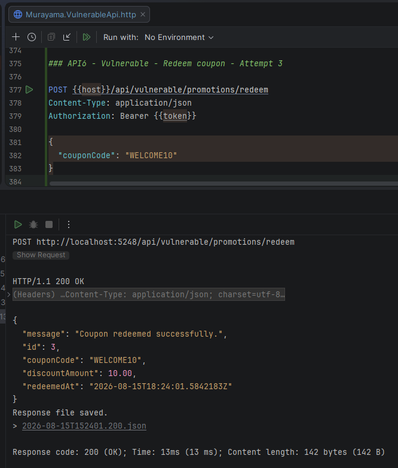
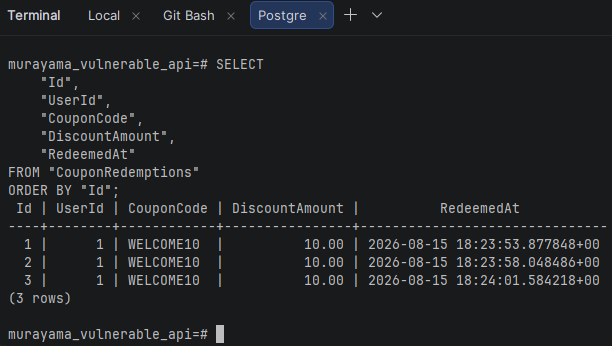
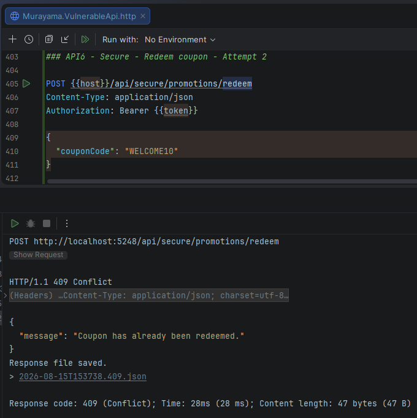
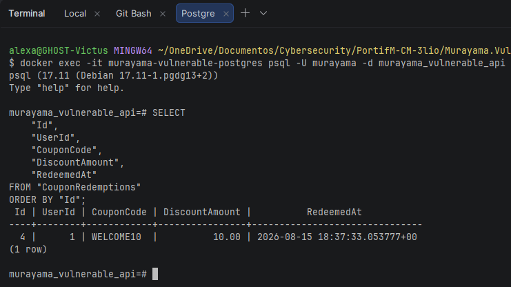

# API6:2023 — Unrestricted Access to Sensitive Business Flows

## Overview

This lab demonstrates **Unrestricted Access to Sensitive Business Flows** in the **Murayama Vulnerable API**, an intentionally vulnerable ASP.NET Core Web API created for cybersecurity and Application Security (AppSec) education.

The vulnerable implementation exposes a legitimate business operation — coupon redemption — without enforcing the business rule that a user may redeem the promotional benefit only once.

As a result, an authenticated user can repeatedly execute the same valid operation and consume the same business benefit multiple times.

The secure implementation enforces a single-redemption rule at both the application and database layers.

---

## Classification

| Item | Classification |
|---|---|
| OWASP API Security Top 10 | API6:2023 — Unrestricted Access to Sensitive Business Flows |
| Security Category | Business Logic / Abuse Prevention |
| Authentication Required | Yes |
| Sensitive Business Flow | Coupon redemption |
| Business Rule | One redemption per user |
| Primary Mitigation | Server-side business rules + database uniqueness |

---

# Scenario

The application provides a promotional coupon:

```text
WELCOME10
```

The coupon grants:

```text
DiscountAmount = 10.00
```

A legitimate user is allowed to redeem this benefit.

However, the intended business rule is:

```text
One user
+
WELCOME10
=
One successful redemption
```

The vulnerable endpoint does not enforce that rule.

---

# Vulnerable Endpoint

```http
POST /api/vulnerable/promotions/redeem
Authorization: Bearer <JWT>
Content-Type: application/json
```

Request:

```json
{
  "couponCode": "WELCOME10"
}
```

The endpoint verifies:

- the caller is authenticated;
- the coupon code is valid.

It then immediately creates a new redemption:

```csharp
var redemption = new CouponRedemption
{
    UserId = userId,
    CouponCode = "WELCOME10",
    DiscountAmount = 10.00m,
    RedeemedAt = DateTime.UtcNow
};

_dbContext.CouponRedemptions.Add(redemption);

await _dbContext.SaveChangesAsync();
```

The missing control is a check that determines whether the authenticated user has already redeemed the coupon.

---

# Root Cause

The vulnerable implementation validates the coupon itself, but does not validate the state of the business process.

Conceptually:

```text
Authenticated user
      │
      ▼
Coupon valid?
      │
      ├── No  → reject
      │
      └── Yes
            │
            ▼
        Create redemption
```

What is missing is:

```text
Has this user already redeemed this coupon?
```

Therefore the same authenticated user can repeat the flow.

---

# Exploitation

> This demonstration is performed only against the intentionally vulnerable local lab environment.

Alice is authenticated using her own valid account and JWT.

She sends:

```http
POST /api/vulnerable/promotions/redeem
Authorization: Bearer <ALICE_JWT>
Content-Type: application/json

{
  "couponCode": "WELCOME10"
}
```

The first request succeeds:

```http
HTTP/1.1 200 OK
```

with a response such as:

```json
{
  "message": "Coupon redeemed successfully.",
  "couponCode": "WELCOME10",
  "discountAmount": 10.00
}
```

This first redemption is legitimate.

---

## Evidence — First Redemption



*Figure 1 — Alice legitimately redeems the WELCOME10 coupon for the first time.*

---

# Repeated Business-Flow Abuse

The same user repeats the same business operation.

Because the vulnerable implementation does not enforce single use, multiple redemption records can be created for the same user and coupon.

Conceptually:

```text
Alice + WELCOME10 → accepted
Alice + WELCOME10 → accepted
Alice + WELCOME10 → accepted
```

The issue is not that Alice is unauthorized to redeem the coupon.

She is authorized.

The issue is that the application does not control **how many times the legitimate business flow may be executed**.

---

## Evidence — Repeated Redemption



*Figure 2 — The vulnerable implementation allows the same user to consume the same promotional benefit multiple times.*

---

# Why This Is Different from BOLA or BFLA

This laboratory is not primarily about whether Alice may access a resource or function.

Alice is legitimately allowed to redeem promotional coupons.

The vulnerable logic fails at the **business-flow level**.

Compare:

```text
BOLA
Can Alice access Bob's object?

BFLA
Can Alice execute an administrative function?

API6
Alice may execute this function,
but how often or under which business conditions?
```

The security problem is abuse of a legitimate operation.

---

# Secure Implementation

The secure endpoint is:

```http
POST /api/secure/promotions/redeem
Authorization: Bearer <JWT>
Content-Type: application/json
```

The application first checks whether the user has already redeemed the coupon:

```csharp
var alreadyRedeemed = await _dbContext.CouponRedemptions
    .AnyAsync(r =>
        r.UserId == userId &&
        r.CouponCode == normalizedCouponCode);

if (alreadyRedeemed)
{
    return Conflict(new
    {
        message = "Coupon has already been redeemed."
    });
}
```

If no redemption exists, the application creates one.

---

# Database-Level Protection

Application-level validation alone is not sufficient under concurrent requests.

Consider two requests arriving almost simultaneously:

```text
Request A
    │
    ├── AnyAsync() → false
    │
Request B
    │
    ├── AnyAsync() → false
```

Both could potentially pass the check before either request inserts the new row.

To protect the invariant at the data layer, the database also enforces a unique constraint on:

```text
UserId + CouponCode
```

The Entity Framework configuration is:

```csharp
modelBuilder.Entity<CouponRedemption>()
    .HasIndex(r => new
    {
        r.UserId,
        r.CouponCode
    })
    .IsUnique();
```

This ensures that the database itself does not allow the same combination twice.

---

# Defense Against Race Conditions

The secure implementation therefore has two layers:

```text
Application check
    │
    └── AnyAsync()
           │
           ▼
     Friendly rejection
```

and:

```text
Database constraint
    │
    └── UNIQUE(UserId, CouponCode)
           │
           ▼
     Final consistency guarantee
```

The insertion is also wrapped with handling for a database conflict:

```csharp
try
{
    await _dbContext.SaveChangesAsync();
}
catch (DbUpdateException)
{
    return Conflict(new
    {
        message = "Coupon has already been redeemed."
    });
}
```

The database constraint protects the business invariant even if two concurrent requests bypass the application-level timing check.

---

# Verification of the Fix

Alice performs the first secure redemption:

```http
POST /api/secure/promotions/redeem
Authorization: Bearer <ALICE_JWT>
Content-Type: application/json

{
  "couponCode": "WELCOME10"
}
```

Result:

```http
HTTP/1.1 200 OK
```

The redemption is persisted.

Alice immediately attempts the same operation again.

Result:

```http
HTTP/1.1 409 Conflict
```

with:

```json
{
  "message": "Coupon has already been redeemed."
}
```

---

## Evidence — Repeated Redemption Blocked



*Figure 3 — The secure endpoint returns HTTP 409 Conflict when Alice attempts to redeem WELCOME10 a second time.*

---

# Database Verification

After the secure test, the PostgreSQL database is queried directly.

Only one redemption exists for:

```text
UserId = 1
CouponCode = WELCOME10
```

This proves that the business rule is enforced at the persisted-data level.

---

## Evidence — PostgreSQL Verification



*Figure 4 — PostgreSQL confirms that only one WELCOME10 redemption exists for Alice.*

---

# Vulnerable vs Secure Behavior

| Action | Vulnerable Endpoint | Secure Endpoint |
|---|---|---|
| First redemption | `200 OK` | `200 OK` |
| Second redemption | `200 OK` ❌ | `409 Conflict` ✅ |
| Third redemption | `200 OK` ❌ | `409 Conflict` ✅ |
| Database duplicates | Allowed ❌ | Prevented ✅ |

---

# Vulnerable vs Secure Flow

## ❌ Vulnerable

```text
Alice
  │
  │ WELCOME10
  ▼
Coupon valid?
  │
  └── Yes
       │
       ▼
Insert redemption
       │
       ▼
200 OK
```

Repeated requests follow exactly the same path.

---

## ✅ Secure

```text
Alice
  │
  │ WELCOME10
  ▼
Coupon valid?
  │
  └── Yes
       │
       ▼
Already redeemed?
       │
   ┌───┴────┐
   │        │
  No       Yes
   │        │
   ▼        ▼
Insert    409 Conflict
   │
   ▼
UNIQUE(UserId, CouponCode)
   │
   ▼
200 OK
```

---

# Why 409 Conflict?

The secure implementation returns:

```http
HTTP/1.1 409 Conflict
```

because the request itself is syntactically valid and the user is authenticated, but the operation conflicts with the current state of the resource/business process.

The coupon is valid.

The user is valid.

However:

```text
This user has already redeemed this coupon.
```

The requested state transition is therefore not allowed.

---

# Security Impact

Unrestricted access to sensitive business flows can result in abuse even when authentication and traditional authorization are functioning correctly.

Potential impacts include:

- repeated coupon redemption
- repeated referral bonuses
- automated purchasing of scarce inventory
- reservation abuse
- mass account creation
- repeated free-trial activation
- repeated promotional credit
- ticket or appointment hoarding
- inventory depletion
- financial loss
- business-rule circumvention

The exact risk depends on which business process is exposed.

---

# Why Rate Limiting Alone Would Not Solve This

Rate limiting can reduce automation speed, but it does not necessarily enforce the underlying business rule.

For example:

```text
Maximum 3 requests per minute
```

would still allow the same user to redeem the coupon again after the time window resets.

The actual business invariant is:

```text
One redemption per user
```

Therefore the application needs a business-state control, not only request throttling.

Both may be used together:

```text
Business rule
    └── May this action occur again?

Rate limiting
    └── How frequently may requests be attempted?
```

---

# Application Validation vs Database Constraint

Using only:

```csharp
AnyAsync(...)
```

improves behavior, but does not provide the strongest consistency guarantee in concurrent scenarios.

Using only the database unique constraint guarantees consistency but may produce less friendly error handling.

Together they provide:

```text
Application validation
        +
Database integrity
        =
Defense in depth
```

This pattern is useful for business rules that must remain true regardless of request timing.

---

# Lessons Learned

This lab demonstrates that API security includes protection of **business processes**, not only technical authentication and authorization checks.

The vulnerable endpoint correctly knows:

```text
Who is the user?
```

and:

```text
Is the coupon valid?
```

but fails to ask:

```text
Is this business action still allowed for this user?
```

That missing state-dependent rule allows abuse.

The secure design enforces the business invariant in both application logic and the database.

---

# References

- OWASP API Security Top 10 — API6:2023 Unrestricted Access to Sensitive Business Flows
- CWE-841 — Improper Enforcement of Behavioral Workflow
- CWE-362 — Concurrent Execution using Shared Resource with Improper Synchronization
- Entity Framework Core — Indexes and Unique Constraints

---

## Disclaimer

Murayama Vulnerable API is an intentionally vulnerable application created for cybersecurity, secure development and Application Security education.

The vulnerable endpoints are designed to demonstrate security flaws in a controlled local environment.

Do not deploy the intentionally vulnerable configuration to production or expose it to untrusted networks.