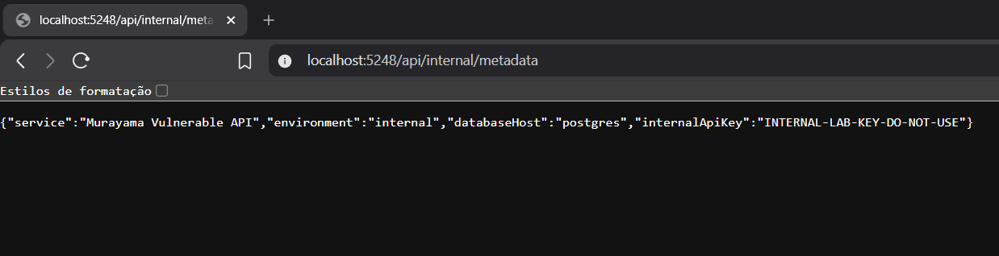
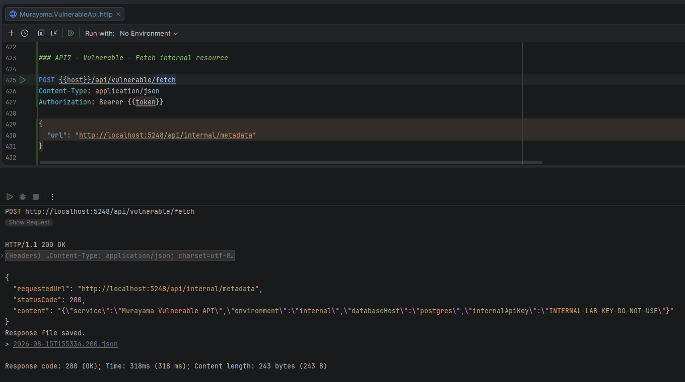
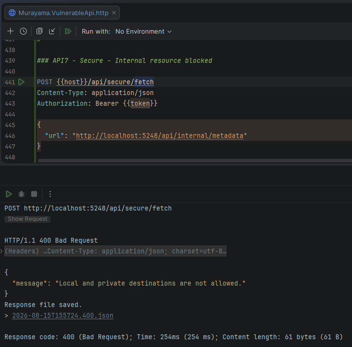

# API7:2023 — Server-Side Request Forgery (SSRF)

## Overview

This lab demonstrates **Server-Side Request Forgery (SSRF)** in the **Murayama Vulnerable API**, an intentionally vulnerable ASP.NET Core Web API created for cybersecurity and Application Security (AppSec) education.

The vulnerable endpoint accepts a URL supplied by an authenticated user and instructs the server to perform an HTTP request to that destination without validating where the request is being sent.

This allows the client to make the application server access a simulated internal resource.

The secure implementation validates the destination before performing the request and blocks loopback and private network addresses.

---

## Classification

| Item | Classification |
|---|---|
| OWASP API Security Top 10 | API7:2023 — Server-Side Request Forgery |
| Security Category | Server-Side Request Forgery |
| Authentication Required | Yes |
| User-Controlled Input | Destination URL |
| Simulated Internal Target | `/api/internal/metadata` |
| Primary Mitigation | Destination validation / allowlisting |

---

# Scenario

The application provides functionality that retrieves content from a URL supplied by the client.

A legitimate use case for this type of functionality could include:

- retrieving remote resources
- validating external URLs
- processing webhooks
- importing remote content
- generating previews
- fetching external documents

However, allowing clients to control the destination of server-side requests introduces a security boundary.

The server may have access to resources that are not intended to be reachable by the client.

---

# Internal Resource Simulation

To demonstrate SSRF safely, this lab uses a simulated internal resource:

```http
GET /api/internal/metadata
```

The endpoint returns intentionally fictitious internal information:

```json
{
  "service": "Murayama Vulnerable API",
  "environment": "internal",
  "databaseHost": "postgres",
  "internalApiKey": "INTERNAL-LAB-KEY-DO-NOT-USE"
}
```

The `internalApiKey` value is deliberately fake and exists only for demonstration purposes.

No real cloud metadata service, external private network, production system, or third-party service is targeted by this lab.

---

## Evidence — Simulated Internal Resource



*Figure 1 — The controlled laboratory resource used to simulate an internal service.*

---

# Vulnerable Implementation

The vulnerable endpoint is:

```http
POST /api/vulnerable/fetch
Authorization: Bearer <JWT>
Content-Type: application/json
```

It receives:

```json
{
  "url": "http://localhost:5248/api/internal/metadata"
}
```

The controller creates an HTTP client:

```csharp
var client = _httpClientFactory.CreateClient();
```

and uses the client-controlled value directly:

```csharp
var response = await client.GetAsync(request.Url);
```

The critical issue is:

```csharp
request.Url
```

is completely controlled by the client.

No destination validation occurs before the server performs the request.

---

# Vulnerable Request Flow

Conceptually:

```text
Client
   │
   │ supplies URL
   ▼
Vulnerable API
   │
   │ GetAsync(request.Url)
   ▼
Destination selected by client
   │
   ▼
HTTP response
   │
   ▼
Vulnerable API
   │
   ▼
Client
```

The client is therefore able to influence where the **server** sends HTTP requests.

---

# Exploitation

> This demonstration is performed only against the intentionally vulnerable local lab environment.

The authenticated client submits:

```http
POST /api/vulnerable/fetch
Authorization: Bearer <JWT>
Content-Type: application/json
```

with:

```json
{
  "url": "http://localhost:5248/api/internal/metadata"
}
```

The vulnerable application performs:

```text
GET http://localhost:5248/api/internal/metadata
```

from the server-side HTTP client.

The response is then returned to the original client.

Example:

```json
{
  "requestedUrl": "http://localhost:5248/api/internal/metadata",
  "statusCode": 200,
  "content": "{\"service\":\"Murayama Vulnerable API\",\"environment\":\"internal\",\"databaseHost\":\"postgres\",\"internalApiKey\":\"INTERNAL-LAB-KEY-DO-NOT-USE\"}"
}
```

The user successfully caused the application to access a server-side destination selected by the user.

---

## Evidence — Vulnerable SSRF



*Figure 2 — The vulnerable fetch endpoint accepts a localhost URL and returns the simulated internal metadata to the client.*

---

# Root Cause

The root cause is unrestricted use of a client-controlled URL in a server-side HTTP request.

The vulnerable implementation effectively performs:

```text
Client input
    │
    ▼
request.Url
    │
    ▼
HttpClient.GetAsync()
```

without asking:

```text
Is this destination allowed?
```

The application validates neither the URI scheme nor the network destination before performing the request.

---

# Why SSRF Is Dangerous

A server often has a different network position than an external client.

For example:

```text
Internet Client
      │
      ▼
Public API
      │
      ├── Internal services
      ├── Databases
      ├── Management interfaces
      ├── Private network resources
      └── Infrastructure services
```

A destination inaccessible directly to the client may still be accessible from the application server.

SSRF attempts to abuse this difference in network access.

Depending on the environment, SSRF can potentially result in:

- access to internal services
- internal network reconnaissance
- exposure of sensitive metadata
- access to management interfaces
- credential exposure
- interaction with trusted internal APIs
- bypass of network-based access controls

This lab does not attempt any of those actions against real infrastructure.

---

# Secure Implementation

The secure endpoint is:

```http
POST /api/secure/fetch
Authorization: Bearer <JWT>
Content-Type: application/json
```

Before making an HTTP request, the application validates the destination.

---

## URI Validation

First, the input must be a valid absolute URI:

```csharp
if (!Uri.TryCreate(
        request.Url,
        UriKind.Absolute,
        out var uri))
{
    return BadRequest(new
    {
        message = "Invalid URL."
    });
}
```

---

## Scheme Validation

Only HTTP and HTTPS are accepted:

```csharp
if (uri.Scheme != Uri.UriSchemeHttp &&
    uri.Scheme != Uri.UriSchemeHttps)
{
    return BadRequest(new
    {
        message = "Only HTTP and HTTPS URLs are allowed."
    });
}
```

This prevents the fetch operation from accepting arbitrary URI schemes.

---

## Loopback Protection

The application rejects loopback destinations:

```csharp
if (uri.IsLoopback)
{
    return BadRequest(new
    {
        message = "Local and private destinations are not allowed."
    });
}
```

Therefore:

```text
localhost
127.0.0.1
::1
```

must not be accepted as remote fetch destinations.

---

# DNS Resolution

Hostnames are resolved before the request:

```csharp
addresses = await Dns.GetHostAddressesAsync(uri.Host);
```

The resulting addresses are evaluated before the HTTP request is performed.

This is important because validating only the textual hostname is insufficient.

For example, a hostname may resolve to an address that belongs to a local or private network.

---

# Private Address Validation

The secure implementation rejects important non-public address ranges, including:

```text
10.0.0.0/8
172.16.0.0/12
192.168.0.0/16
169.254.0.0/16
0.0.0.0/8
IPv4 loopback
IPv6 loopback
IPv6 link-local
IPv6 unique-local addresses
```

The validation occurs before `HttpClient` is allowed to perform the request.

---

# Verification of the Fix

The exact URL that succeeds against the vulnerable endpoint is submitted to the secure endpoint:

```json
{
  "url": "http://localhost:5248/api/internal/metadata"
}
```

Instead of accessing the destination, the secure endpoint returns:

```http
HTTP/1.1 400 Bad Request
```

with:

```json
{
  "message": "Local and private destinations are not allowed."
}
```

The server-side request is therefore prevented.

---

## Evidence — SSRF Blocked



*Figure 3 — The secure endpoint rejects the same localhost destination that succeeded against the vulnerable endpoint.*

---

# Vulnerable vs Secure Behavior

| Request | Vulnerable | Secure |
|---|---|---|
| Valid HTTP URL | Requested | Validated first |
| `localhost` | Allowed ❌ | Blocked ✅ |
| Loopback IP | Allowed ❌ | Blocked ✅ |
| Private IPv4 | Allowed ❌ | Blocked ✅ |
| IPv6 local address | Allowed ❌ | Blocked ✅ |
| Arbitrary URI scheme | Passed to HTTP client ❌ | Blocked ✅ |

For the laboratory demonstration:

```text
http://localhost:5248/api/internal/metadata
```

produces:

```text
Vulnerable → 200 OK
Secure     → 400 Bad Request
```

---

# Vulnerable vs Secure Flow

## ❌ Vulnerable

```text
User-controlled URL
        │
        ▼
HttpClient.GetAsync()
        │
        ▼
Internal resource
        │
        ▼
Sensitive response
        │
        ▼
Client
```

## ✅ Secure

```text
User-controlled URL
        │
        ▼
Valid URI?
        │
        ▼
HTTP/HTTPS?
        │
        ▼
Loopback?
        │
        ▼
Resolve hostname
        │
        ▼
Private/local IP?
        │
    ┌───┴────┐
    │        │
   Yes       No
    │        │
    ▼        ▼
  Reject   Request
```

---

# Why an Allowlist Is Preferable

Blocking known-dangerous destinations is useful, but it is difficult to enumerate every possible unsafe destination.

When application requirements permit it, a stronger design is to define exactly which destinations are allowed.

For example:

```text
Allowed destinations:
api.example-partner.com
images.example-cdn.com
```

Then:

```text
Destination in allowlist?
       │
   ┌───┴────┐
   │        │
  Yes       No
   │        │
   ▼        ▼
Request    Reject
```

This changes the security model from:

```text
Allow everything except known bad destinations
```

to:

```text
Reject everything except explicitly approved destinations
```

For sensitive server-side fetch functionality, this is generally easier to reason about securely.

---

# Redirect Handling

A production SSRF defense must also consider HTTP redirects.

For example:

```text
Approved public URL
        │
        ▼
HTTP 302
        │
        ▼
Private destination
```

If redirects are automatically followed without validating every new destination, an attacker may be able to bypass validation performed only on the initial URL.

Possible defenses include:

- disabling automatic redirects;
- validating every redirect target;
- enforcing the same destination policy after each redirect.

The simplified secure implementation in this lab focuses on demonstrating destination validation and should not be interpreted as a complete production-grade SSRF gateway.

---

# DNS Rebinding and TOCTOU

DNS introduces another important complication.

A hostname can potentially resolve differently at different moments:

```text
Validation
    │
    ▼
Public IP
```

and later:

```text
Connection
    │
    ▼
Private IP
```

This creates a potential **time-of-check/time-of-use (TOCTOU)** problem.

Production defenses may require stronger network controls and careful handling of DNS resolution rather than relying only on a one-time application-level DNS check.

---

# Defense in Depth

SSRF protection should not rely exclusively on application validation.

Additional protections can include:

- strict destination allowlists
- outbound firewall rules
- network segmentation
- egress filtering
- restricted service identities
- disabling unnecessary redirects
- DNS controls
- request timeouts
- response-size limits
- protocol restrictions
- monitoring unusual outbound requests

The application should have access only to the network resources it genuinely needs.

---

# Laboratory Design Note

The simulated internal endpoint is hosted by the same local application and can therefore also be accessed directly from the developer's browser.

This is intentional for demonstration purposes.

In a real architecture, an SSRF target would typically represent a resource that is reachable from the application server but not directly exposed to the external client.

The lab demonstrates the **server-side request control flaw**, rather than attempting to reproduce a production network topology.

---

# Security Impact

Successful SSRF can potentially allow attackers to make requests using the server's network position and trust relationships.

Possible impacts include:

- internal service access
- sensitive information disclosure
- credential exposure
- internal API interaction
- network reconnaissance
- bypass of network access restrictions
- interaction with infrastructure services
- pivoting to additional systems

The impact depends heavily on the server's network permissions and available internal services.

---

# Mitigation

Recommended practices include:

1. Avoid arbitrary server-side URL fetching when possible.

2. Prefer strict destination allowlists.

3. Restrict accepted URI schemes.

4. Block loopback, private, link-local and otherwise inappropriate destinations.

5. Validate resolved IP addresses, not only hostnames.

6. Handle HTTP redirects securely.

7. Consider DNS rebinding and TOCTOU risks.

8. Apply outbound network restrictions and egress filtering.

9. Run applications with least network privilege.

10. Configure connection and request timeouts.

11. Limit response sizes.

12. Monitor unexpected outbound network activity.

---

# Lessons Learned

This lab demonstrates that user-controlled URLs are not ordinary string inputs when they are consumed by a server-side HTTP client.

The vulnerable implementation asks:

```text
What URL did the client provide?
```

and immediately requests it.

The secure design must additionally ask:

```text
Is the server permitted to communicate with this destination?
```

This distinction is fundamental to SSRF prevention.

The strongest solution is usually to minimize the destinations the server is allowed to contact rather than attempting to identify every destination that might be dangerous.

---

# References

- OWASP API Security Top 10 — API7:2023 Server Side Request Forgery
- CWE-918 — Server-Side Request Forgery (SSRF)
- OWASP Server-Side Request Forgery Prevention Cheat Sheet
- Microsoft .NET HttpClient

---

## Disclaimer

Murayama Vulnerable API is an intentionally vulnerable application created for cybersecurity, secure development and Application Security education.

The vulnerable endpoints are designed to demonstrate security flaws in a controlled local environment.

No real cloud metadata service, production system, private third-party network, or external infrastructure is targeted by this laboratory.

Do not deploy the intentionally vulnerable configuration to production or expose it to untrusted networks.