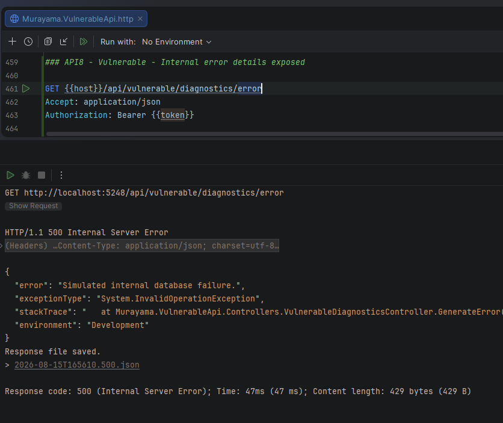
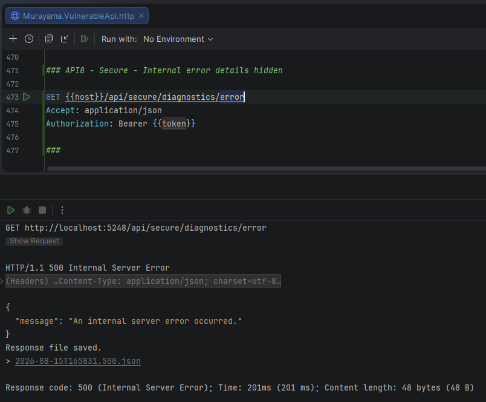
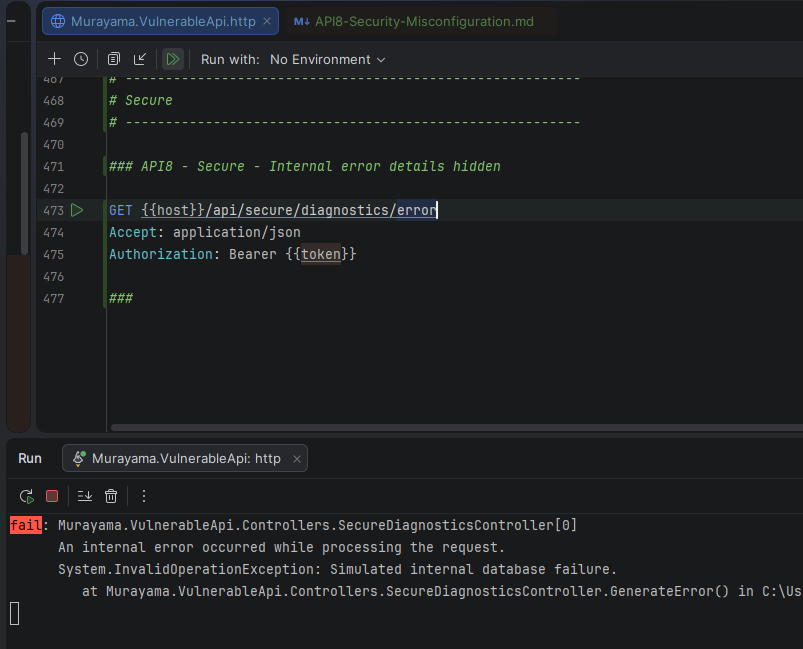

# API8:2023 — Security Misconfiguration

## Overview

This lab demonstrates **Security Misconfiguration** in the **Murayama Vulnerable API**, an intentionally vulnerable ASP.NET Core Web API created for cybersecurity and Application Security (AppSec) education.

The vulnerable implementation exposes internal exception details directly in the HTTP response, including the exception type, stack trace and application environment.

This information should normally remain internal to the application because it can reveal implementation details that may help an attacker understand the application's architecture and identify additional attack opportunities.

The secure implementation returns a generic error message to the client while preserving detailed diagnostic information in server-side logs.

---

## Classification

| Item | Classification |
|---|---|
| OWASP API Security Top 10 | API8:2023 — Security Misconfiguration |
| Security Category | Information Disclosure / Error Handling |
| Authentication Required | Yes |
| Exposed Information | Exception details, stack trace, environment |
| Primary Mitigation | Secure error handling and server-side logging |

---

# Scenario

Applications inevitably encounter unexpected errors.

During development, detailed error information can be useful for troubleshooting.

However, returning these details directly to API clients can expose internal implementation information.

The vulnerable endpoint deliberately simulates an internal failure:

```text
Simulated internal database failure.
```

The difference between the vulnerable and secure implementations is how that failure is handled.

---

# Vulnerable Endpoint

The vulnerable endpoint is:

```http
GET /api/vulnerable/diagnostics/error
Authorization: Bearer <JWT>
```

The controller intentionally generates an exception:

```csharp
throw new InvalidOperationException(
    "Simulated internal database failure.");
```

The exception is then caught and its internal details are returned directly to the client:

```csharp
catch (Exception ex)
{
    return StatusCode(
        StatusCodes.Status500InternalServerError,
        new
        {
            error = ex.Message,
            exceptionType = ex.GetType().FullName,
            stackTrace = ex.StackTrace,
            environment = Environment.GetEnvironmentVariable(
                "ASPNETCORE_ENVIRONMENT")
        });
}
```

---

# Information Exposed

The response contains information such as:

```text
error
exceptionType
stackTrace
environment
```

For example:

```json
{
  "error": "Simulated internal database failure.",
  "exceptionType": "System.InvalidOperationException",
  "stackTrace": "...",
  "environment": "Development"
}
```

This exposes diagnostic information that should generally remain on the server.

---

## Evidence — Internal Error Details Exposed



*Figure 1 — The vulnerable endpoint returns exception type, stack trace and environment information directly to the API client.*

---

# Root Cause

The root cause is not the existence of an exception.

Errors are normal application events.

The security problem is the decision to expose internal diagnostic information across the API trust boundary.

The vulnerable flow is:

```text
Application error
       │
       ▼
Exception
       │
       ▼
Catch exception
       │
       ▼
Extract technical details
       │
       ▼
Return details to client
       │
       ▼
Information disclosure
```

The application treats debugging information as part of the public API response.

---

# Why Detailed Errors Can Be Dangerous

Detailed error responses may reveal information about the application's internal implementation.

Depending on the application, exposed errors may disclose:

- framework information
- class names
- namespaces
- source-code paths
- internal service names
- database technologies
- query information
- application environment
- internal architecture
- library details

An attacker may combine this information with other weaknesses.

Even when an error message does not directly expose credentials or secrets, unnecessary technical information can improve an attacker's understanding of the system.

---

# Secure Implementation

The secure endpoint is:

```http
GET /api/secure/diagnostics/error
Authorization: Bearer <JWT>
```

The same simulated exception occurs:

```csharp
throw new InvalidOperationException(
    "Simulated internal database failure.");
```

However, the secure implementation handles the exception differently:

```csharp
catch (Exception ex)
{
    _logger.LogError(
        ex,
        "An internal error occurred while processing the request.");

    return StatusCode(
        StatusCodes.Status500InternalServerError,
        new
        {
            message = "An internal server error occurred."
        });
}
```

The client receives only the information required to understand that the request failed.

---

# Secure Client Response

The secure endpoint still correctly returns:

```http
HTTP/1.1 500 Internal Server Error
```

but the response contains only:

```json
{
  "message": "An internal server error occurred."
}
```

The response does not expose:

```text
exceptionType
stackTrace
environment
```

---

## Evidence — Internal Details Hidden



*Figure 2 — The secure endpoint returns HTTP 500 with a generic message and does not expose internal diagnostic information.*

---

# Server-Side Logging

Hiding technical details from the client does not mean diagnostic information should be discarded.

The secure implementation records the exception using:

```csharp
_logger.LogError(
    ex,
    "An internal error occurred while processing the request.");
```

The server log therefore retains information such as:

```text
System.InvalidOperationException
Simulated internal database failure
stack trace
source location
```

This information remains available to developers and operators for troubleshooting.

---

## Evidence — Detailed Server Log



*Figure 3 — Detailed exception information is recorded in the server-side log while remaining hidden from the API client.*

---

# Vulnerable vs Secure Behavior

| Information | Vulnerable Response | Secure Response | Server Log |
|---|---|---|---|
| HTTP 500 | Yes | Yes | Recorded |
| Generic failure message | No | Yes | Yes |
| Exception message | Exposed ❌ | Hidden ✅ | Available |
| Exception type | Exposed ❌ | Hidden ✅ | Available |
| Stack trace | Exposed ❌ | Hidden ✅ | Available |
| Environment | Exposed ❌ | Hidden ✅ | Available when appropriate |

The goal is not to eliminate diagnostic information.

The goal is to keep it on the correct side of the trust boundary.

---

# Vulnerable vs Secure Flow

## ❌ Vulnerable

```text
Internal exception
       │
       ▼
Exception details
       │
       ├── Type
       ├── Message
       ├── Stack trace
       └── Environment
              │
              ▼
         HTTP response
              │
              ▼
            Client
```

## ✅ Secure

```text
                 Internal exception
                        │
              ┌─────────┴─────────┐
              │                   │
              ▼                   ▼
         Server log          HTTP response
              │                   │
       detailed data          generic error
              │                   │
              ▼                   ▼
      Developers/Ops             Client
```

---

# Why HTTP 500 Is Still Correct

The secure endpoint still returns:

```http
500 Internal Server Error
```

This is intentional.

The security improvement is not to hide the fact that an error occurred.

The client needs to know that the server was unable to complete the operation.

What the client does not need is the application's internal debugging information.

Therefore:

```text
Failure status → public
Internal diagnostics → private
```

---

# Development vs Production

Development environments often provide richer diagnostic information because developers need visibility into application failures.

Production systems should avoid exposing detailed developer exception pages or equivalent debugging output to untrusted clients.

Environment-specific configuration should therefore be reviewed carefully.

A configuration that is convenient during development may be inappropriate when the application is deployed.

---

# Security Misconfiguration Beyond Error Handling

Security Misconfiguration is broader than stack-trace exposure.

Other examples may include:

- unnecessary HTTP methods
- default credentials
- verbose error messages
- debug mode enabled in production
- unnecessary services
- insecure default settings
- missing security headers
- overly permissive CORS
- unnecessary administrative interfaces
- directory listing
- exposed diagnostic endpoints
- insecure cloud permissions
- unnecessary framework features
- outdated or insecure configuration

This lab intentionally focuses on **error-information disclosure** because it provides a controlled and easily observable demonstration.

---

# Logging Considerations

Server-side logging must also be handled securely.

Logs should not unnecessarily contain:

- passwords
- authentication tokens
- API keys
- session identifiers
- sensitive personal information
- payment information
- secrets

Detailed logging is useful for diagnostics, but logs themselves become sensitive assets and should be protected accordingly.

Access to production logs should follow least-privilege principles.

---

# Centralized Exception Handling

The controller-level `try/catch` used in this lab makes the vulnerable and secure behaviors easy to compare.

In a production ASP.NET Core application, error handling is often centralized using middleware or exception handlers.

Conceptually:

```text
Request
   │
   ▼
Controller
   │
   ▼
Exception
   │
   ▼
Global exception handler
   │
   ├── Log technical details
   │
   └── Return sanitized response
```

Centralization helps provide consistent error handling across the API.

---

# Defense in Depth

Secure error handling should be combined with additional configuration controls such as:

- production-safe environment configuration
- centralized exception handling
- structured server-side logging
- restricted log access
- secret management
- secure HTTP headers
- restrictive CORS configuration
- removal of unused services
- secure defaults
- regular configuration reviews
- automated security testing
- infrastructure hardening

Security configuration should be treated as part of the application's security architecture rather than as an afterthought.

---

# Security Impact

Information exposed through security misconfiguration may help attackers understand the internal structure of an application.

Potential impacts include:

- disclosure of implementation details
- exposure of internal file paths
- framework fingerprinting
- disclosure of environment information
- exposure of internal service names
- improved reconnaissance
- easier identification of additional vulnerabilities

The impact depends on the type and sensitivity of the exposed information.

---

# Mitigation

Recommended practices include:

1. Never return stack traces to untrusted clients.

2. Return generic error messages for unexpected server failures.

3. Log technical details server-side.

4. Disable development diagnostics in production.

5. Use centralized exception handling.

6. Review environment-specific configuration.

7. Avoid logging secrets and authentication credentials.

8. Restrict access to application logs.

9. Remove unnecessary services and endpoints.

10. Apply secure configuration consistently across environments.

11. Review CORS, HTTP headers and exposed administrative functionality.

12. Automate configuration checks where possible.

---

# Lessons Learned

This lab demonstrates an important principle:

> Diagnostic information should be available to the people operating the application, not automatically exposed to API clients.

Both implementations encounter exactly the same exception.

The difference is where the diagnostic information goes.

The vulnerable implementation sends it across the API boundary:

```text
Exception → Client
```

The secure implementation separates operational diagnostics from the public response:

```text
Exception
   ├── details → server log
   └── generic message → client
```

Secure error handling therefore preserves observability without unnecessarily disclosing internal implementation details.

---

# References

- OWASP API Security Top 10 — API8:2023 Security Misconfiguration
- CWE-209 — Generation of Error Message Containing Sensitive Information
- CWE-200 — Exposure of Sensitive Information to an Unauthorized Actor
- ASP.NET Core Error Handling
- OWASP Error Handling Cheat Sheet

---

## Disclaimer

Murayama Vulnerable API is an intentionally vulnerable application created for cybersecurity, secure development and Application Security education.

The vulnerable endpoints are designed to demonstrate security flaws in a controlled local environment.

Do not deploy the intentionally vulnerable configuration to production or expose it to untrusted networks.