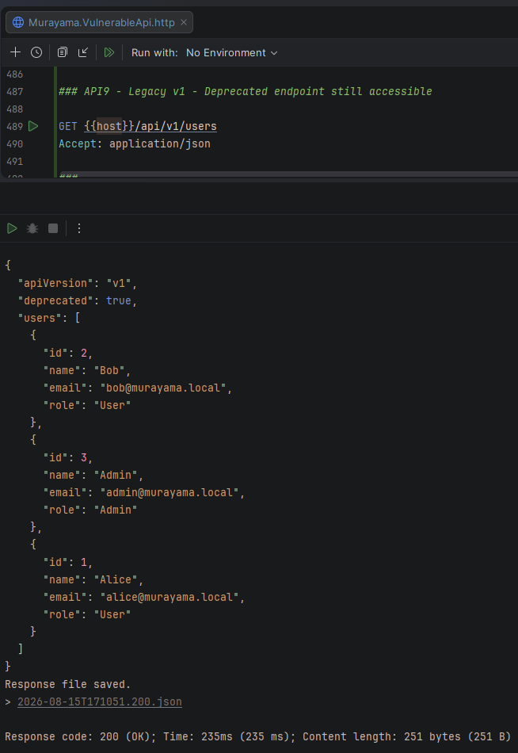
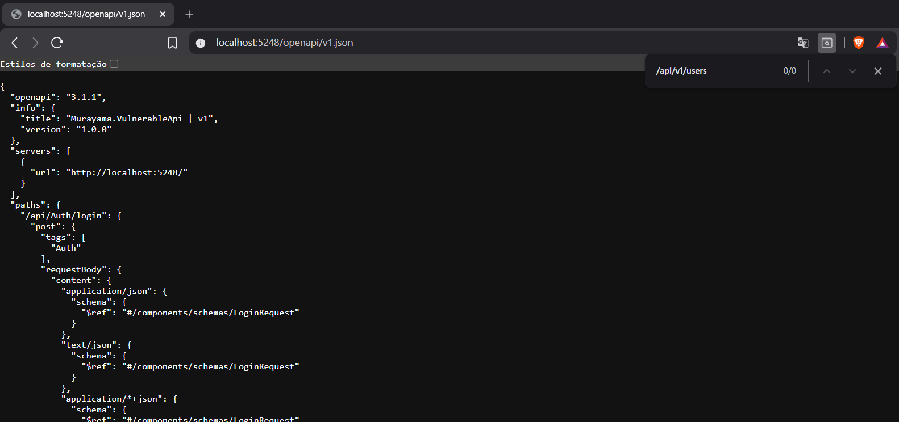
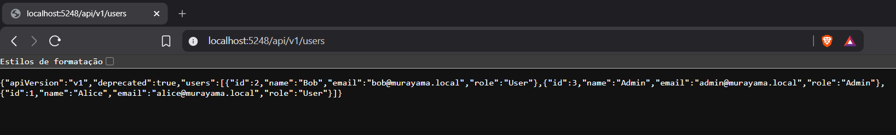
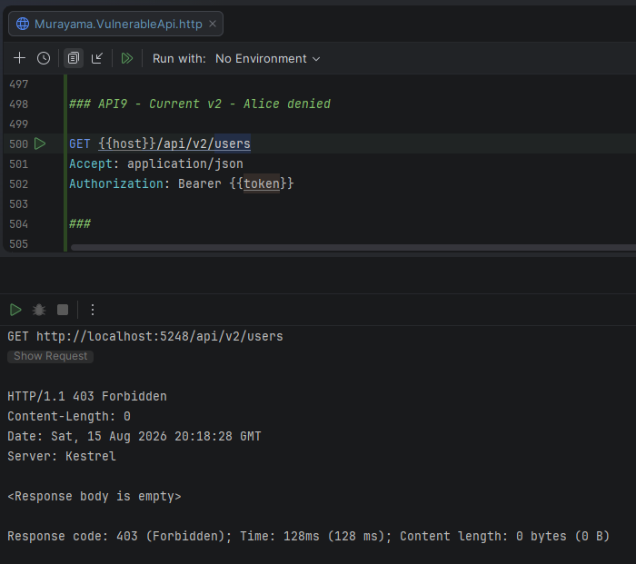
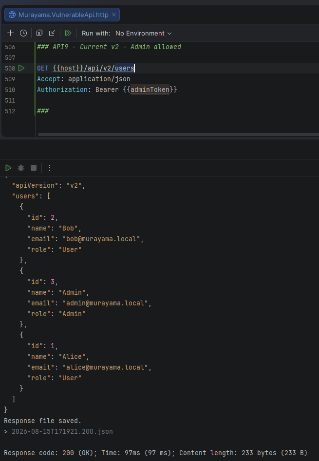

# API9:2023 — Improper Inventory Management

## Overview

This lab demonstrates **Improper Inventory Management** in the **Murayama Vulnerable API**, an intentionally vulnerable ASP.NET Core Web API created for cybersecurity and Application Security (AppSec) education.

The application contains a deprecated `v1` API endpoint that remains deployed even though a newer `v2` version exists.

The legacy endpoint is intentionally excluded from the OpenAPI documentation, creating a discrepancy between the documented API inventory and the actual runtime attack surface.

More importantly, the deprecated version does not enforce the authorization controls implemented by the current version.

As a result, an undocumented legacy endpoint remains accessible without authentication and exposes user information.

---

## Classification

| Item | Classification |
|---|---|
| OWASP API Security Top 10 | API9:2023 — Improper Inventory Management |
| Security Category | API Inventory / Attack Surface Management |
| Legacy Version | `v1` |
| Current Version | `v2` |
| Legacy Authentication | None |
| Current Authorization | Admin only |
| Primary Mitigation | Accurate inventory and legacy API retirement |

---

# Scenario

The application has evolved from an older API version:

```text
/api/v1/users
```

to a newer version:

```text
/api/v2/users
```

The current version implements the expected authorization requirement:

```text
Only administrators may list all users.
```

However, the old `v1` endpoint was never removed.

It remains deployed and reachable even though it has been excluded from the application's OpenAPI documentation.

This creates a mismatch:

```text
Documented API surface
        ≠
Actual deployed API surface
```

---

# Legacy API Version

The legacy endpoint is:

```http
GET /api/v1/users
```

It is implemented by:

```csharp
[ApiController]
[Route("api/v1/users")]
[ApiExplorerSettings(IgnoreApi = true)]
public class LegacyUsersController : ControllerBase
{
    private readonly AppDbContext _dbContext;

    public LegacyUsersController(AppDbContext dbContext)
    {
        _dbContext = dbContext;
    }

    [HttpGet]
    public async Task<IActionResult> GetUsers()
    {
        var users = await _dbContext.Users
            .AsNoTracking()
            .Select(u => new
            {
                u.Id,
                u.Name,
                u.Email,
                u.Role
            })
            .ToListAsync();

        return Ok(new
        {
            apiVersion = "v1",
            deprecated = true,
            users
        });
    }
}
```

Two important characteristics are intentionally present in this implementation.

First, the endpoint has no authorization requirement:

```text
No [Authorize]
```

Second, it is hidden from API discovery:

```csharp
[ApiExplorerSettings(IgnoreApi = true)]
```

The endpoint therefore represents a deprecated API version that remains deployed but is absent from the normal API documentation.

---

# Unauthenticated Access to the Legacy API

> This demonstration is performed only against the intentionally vulnerable local lab environment.

A request is sent directly to the legacy endpoint:

```http
GET /api/v1/users
Accept: application/json
```

No JWT is provided.

Despite this, the server returns:

```http
HTTP/1.1 200 OK
```

and exposes the user list.

A response contains information such as:

```json
{
  "apiVersion": "v1",
  "deprecated": true,
  "users": [
    {
      "id": 1,
      "name": "Alice",
      "email": "alice@murayama.local",
      "role": "User"
    },
    {
      "id": 2,
      "name": "Bob",
      "email": "bob@murayama.local",
      "role": "User"
    },
    {
      "id": 3,
      "name": "Admin",
      "email": "admin@murayama.local",
      "role": "Admin"
    }
  ]
}
```

The client does not need to authenticate because the old version never received the authorization controls implemented by the newer API.

---

## Evidence — Legacy API Accessible Without Authentication



*Figure 1 — The deprecated `/api/v1/users` endpoint returns HTTP 200 OK and user information without requiring authentication.*

---

# Missing from the OpenAPI Inventory

The legacy controller contains:

```csharp
[ApiExplorerSettings(IgnoreApi = true)]
```

As a result, `/api/v1/users` is not included in the generated OpenAPI documentation.

Searching the OpenAPI definition for:

```text
/api/v1/users
```

does not reveal the legacy endpoint.

This creates an incomplete representation of the application's actual API surface.

---

## Evidence — Legacy Endpoint Missing from OpenAPI



*Figure 2 — The OpenAPI inventory does not contain the deployed `/api/v1/users` endpoint.*

---

# Undocumented Does Not Mean Unreachable

The absence of the legacy endpoint from OpenAPI does not disable the route.

The application still registers the controller at runtime.

Therefore, directly navigating to:

```text
http://localhost:5248/api/v1/users
```

successfully reaches the endpoint.

This demonstrates an important API security principle:

> An undocumented endpoint remains part of the attack surface as long as it is deployed and reachable.

---

## Evidence — Direct Browser Access to Legacy Endpoint



*Figure 3 — Although `/api/v1/users` is absent from the OpenAPI inventory, the legacy endpoint remains deployed and can be accessed directly.*

---

# Inventory Discrepancy

The laboratory therefore contains two different views of the API.

The documented view:

```text
OpenAPI inventory
       │
       └── /api/v1/users
                │
                └── NOT PRESENT
```

The actual runtime view:

```text
Application runtime
       │
       └── /api/v1/users
                │
                └── ACTIVE
                     │
                     └── 200 OK
```

This discrepancy is the central issue demonstrated by the lab.

---

# Why Hiding an Endpoint Is Not a Security Control

The following attribute:

```csharp
[ApiExplorerSettings(IgnoreApi = true)]
```

affects API discovery and documentation.

It does **not** provide authorization.

It does not:

```text
disable the route
require authentication
restrict access
remove the controller
prevent HTTP requests
```

It only prevents the endpoint from appearing through the API explorer mechanism.

Therefore:

```text
Hidden from documentation
          ≠
Protected
```

and:

```text
Undocumented
          ≠
Unavailable
```

Security controls must be enforced independently of whether an endpoint is publicly documented.

---

# Current API Version

The current endpoint is:

```http
GET /api/v2/users
```

Unlike the legacy version, the current controller explicitly defines its authorization requirement:

```csharp
[ApiController]
[Route("api/v2/users")]
[Authorize(Roles = "Admin")]
public class CurrentUsersController : ControllerBase
```

The important control is:

```csharp
[Authorize(Roles = "Admin")]
```

Therefore the current API requires:

```text
Authenticated = Yes
AND
Role = Admin
```

---

# Verification — Normal User Against v2

Alice has:

```text
Role = User
```

She sends:

```http
GET /api/v2/users
Authorization: Bearer <ALICE_JWT>
```

Alice is successfully authenticated but does not have the required role.

The server therefore returns:

```http
HTTP/1.1 403 Forbidden
```

This is the expected authorization behavior.

---

## Evidence — Current API Rejects Normal User



*Figure 4 — The current v2 endpoint returns HTTP 403 Forbidden when Alice, who has the User role, attempts to access the administrative user list.*

---

# Verification — Administrator Against v2

The Admin account has:

```text
Role = Admin
```

The same endpoint is requested using the administrator's JWT:

```http
GET /api/v2/users
Authorization: Bearer <ADMIN_JWT>
```

The server evaluates the role requirement successfully and returns:

```http
HTTP/1.1 200 OK
```

with the user list.

This demonstrates that the current API is not simply inaccessible.

Instead, it enforces the intended authorization policy.

---

## Evidence — Administrator Accesses Current API



*Figure 5 — The Admin user successfully accesses the current v2 endpoint and receives HTTP 200 OK.*

---

# Legacy vs Current API

| Characteristic | Legacy v1 | Current v2 |
|---|---|---|
| Endpoint | `/api/v1/users` | `/api/v2/users` |
| Status | Deprecated ❌ | Current ✅ |
| Deployed | Yes ❌ | Yes |
| OpenAPI inventory | Hidden ❌ | Documented ✅ |
| Authentication required | No ❌ | Yes ✅ |
| Admin authorization | No ❌ | Yes ✅ |
| Anonymous request | `200 OK` ❌ | Rejected ✅ |
| Alice (`User`) | `200 OK` ❌ | `403 Forbidden` ✅ |
| Admin | `200 OK` | `200 OK` ✅ |

The strongest protection implemented in `v2` becomes irrelevant if clients can simply bypass it by using the forgotten `v1` route.

---

# Security Control Bypass Through Legacy Versions

Consider the intended architecture:

```text
Client
   │
   ▼
/api/v2/users
   │
   ▼
Authentication
   │
   ▼
Admin authorization
   │
   ├── User  → 403
   │
   └── Admin → 200
```

The forgotten API creates an alternative path:

```text
Client
   │
   ├───────────────► /api/v2/users
   │                       │
   │                  authorization
   │
   └───────────────► /api/v1/users
                           │
                      no authorization
                           │
                           ▼
                         200 OK
```

An attacker does not need to defeat the security controls in `v2` if an older and weaker API version remains available.

---

# Root Cause

The root cause is failure to maintain an accurate inventory and lifecycle for deployed API assets.

The application has:

```text
Version v1
    │
    ├── deprecated
    ├── undocumented
    └── still deployed

Version v2
    │
    ├── current
    ├── documented
    └── properly protected
```

The security team may focus on the current API while the legacy implementation remains part of the externally reachable attack surface.

---

# API Inventory vs API Documentation

API documentation and API inventory are related, but they are not necessarily the same thing.

Documentation answers questions such as:

```text
Which endpoints should consumers use?
```

Security inventory must answer:

```text
Which endpoints actually exist and are reachable?
```

A complete inventory should consider more than what appears in OpenAPI.

For example:

```text
API Inventory
    │
    ├── hosts
    ├── environments
    ├── API versions
    ├── endpoints
    ├── deprecated endpoints
    ├── authentication requirements
    ├── ownership
    └── lifecycle status
```

An endpoint should not disappear from security oversight simply because it disappeared from documentation.

---

# API Lifecycle Management

API versions should have an explicit lifecycle.

For example:

```text
Development
     │
     ▼
Published
     │
     ▼
Supported
     │
     ▼
Deprecated
     │
     ▼
Retired
     │
     ▼
Removed
```

A common risk occurs when the lifecycle stops here:

```text
Deprecated
     │
     └── still running indefinitely
```

Deprecation is communication.

Retirement and removal are security actions.

---

# Recommended Remediation for the Legacy Endpoint

The preferred remediation is not merely to add `[Authorize]` to the old endpoint.

If `v1` is genuinely obsolete, the better approach is to remove it from the deployed application.

Conceptually:

```text
/api/v1/users
     │
     ▼
Deprecated
     │
     ▼
Migration period
     │
     ▼
Retired
     │
     ▼
Route removed
```

Once clients have migrated to `v2`, the old implementation should no longer remain part of the runtime attack surface.

---

# Temporary Legacy Support

Sometimes an old API cannot be removed immediately because legitimate clients still depend on it.

During a migration period, the legacy API should still receive appropriate security controls.

For example:

```text
Legacy API
    │
    ├── authentication
    ├── authorization
    ├── monitoring
    ├── rate limiting
    ├── security fixes
    └── defined retirement date
```

"Legacy" should never mean:

```text
No longer maintained,
but still exposed.
```

---

# Why the Current API Does Not Fix the Legacy API

Adding strong security controls to `v2` does not automatically protect `v1`.

Each deployed route remains independently reachable.

Therefore:

```text
Secure v2
+
Insecure v1
=
Insecure overall attack surface
```

Security assessments must consider all reachable versions, not only the newest implementation.

---

# Shadow and Zombie APIs

Improper inventory management is often associated with concepts such as **shadow APIs** and **zombie APIs**.

A shadow API may exist outside the expected governance or inventory process.

A zombie API is generally an obsolete or deprecated API that remains deployed even though it should no longer be in active use.

The `v1` endpoint in this lab simulates the latter pattern:

```text
Old
Deprecated
Undocumented
Still reachable
```

This makes it an example of the type of forgotten API asset that proper inventory management is intended to identify.

---

# Environments Matter Too

API inventory should not focus only on production versions.

Organizations may have:

```text
Production
Staging
Testing
Development
Preview
Legacy
```

An old staging or development deployment can become a security issue if it is reachable and has weaker controls.

Inventory management should therefore consider both:

```text
What APIs exist?
```

and:

```text
Where are they deployed?
```

---

# Defense in Depth

Effective API inventory management can include:

- centralized API catalogs
- API gateway inventories
- automated endpoint discovery
- OpenAPI specifications
- version ownership
- lifecycle metadata
- deprecation policies
- retirement deadlines
- external attack-surface monitoring
- route discovery during security testing
- CI/CD deployment inventories
- regular review of DNS and hosts
- monitoring for unexpected API traffic

No single source should automatically be assumed to represent the complete attack surface.

---

# Security Impact

Improper API inventory management can leave outdated or forgotten assets exposed after newer systems have been secured.

Potential impacts include:

- bypass of current authentication controls
- bypass of current authorization controls
- exposure through deprecated endpoints
- access to outdated functionality
- exploitation of unpatched legacy code
- sensitive data disclosure
- forgotten development or staging systems
- inconsistent security policies between versions
- increased and poorly understood attack surface

The risk grows as the number of versions, environments and API deployments increases.

---

# Mitigation

Recommended practices include:

1. Maintain an accurate inventory of all deployed APIs.

2. Track API versions and lifecycle status.

3. Identify an owner for every API.

4. Define deprecation and retirement policies.

5. Remove obsolete API versions after migration periods.

6. Apply security controls to legacy APIs while they remain deployed.

7. Inventory production, staging, testing and development environments.

8. Compare documented endpoints with actual runtime routes.

9. Monitor traffic to deprecated APIs before retirement.

10. Include API discovery in security assessments.

11. Review API gateway, load balancer, DNS and deployment configurations.

12. Avoid treating undocumented endpoints as protected endpoints.

---

# Lessons Learned

This lab demonstrates a simple but important principle:

> The security of an API depends on what is actually deployed, not only on what is documented.

The current `v2` API correctly enforces:

```text
Authentication
+
Admin authorization
```

However, those controls can be bypassed because an older version remains available:

```text
/api/v1/users
```

The legacy route is:

```text
deprecated
undocumented
unprotected
still reachable
```

The correct security response is therefore not merely to secure new versions.

Organizations must know which API assets exist, where they are deployed, who owns them, which versions are supported, and when obsolete versions should be removed.

---

# References

- OWASP API Security Top 10 — API9:2023 Improper Inventory Management
- OWASP API Security Top 10
- OWASP Web Security Testing Guide
- API lifecycle and version management practices

---

## Disclaimer

Murayama Vulnerable API is an intentionally vulnerable application created for cybersecurity, secure development and Application Security education.

The vulnerable and legacy endpoints are designed to demonstrate security flaws in a controlled local environment.

Do not deploy the intentionally vulnerable configuration to production or expose it to untrusted networks.